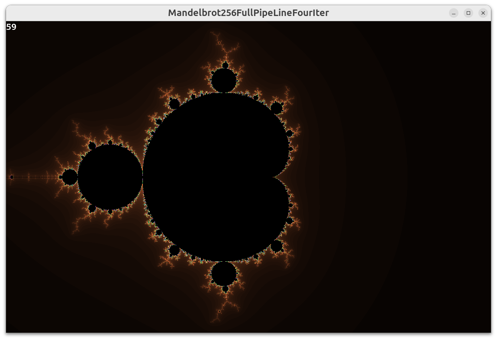
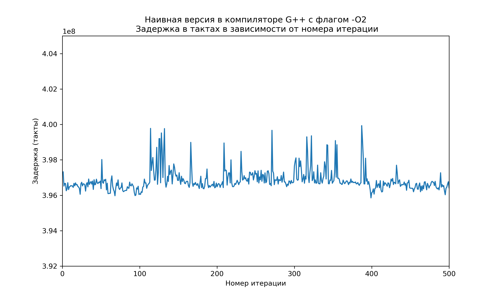
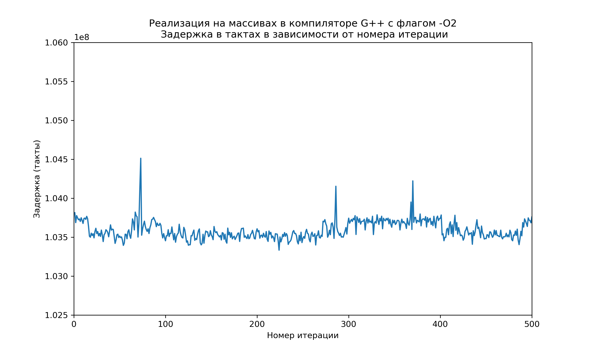
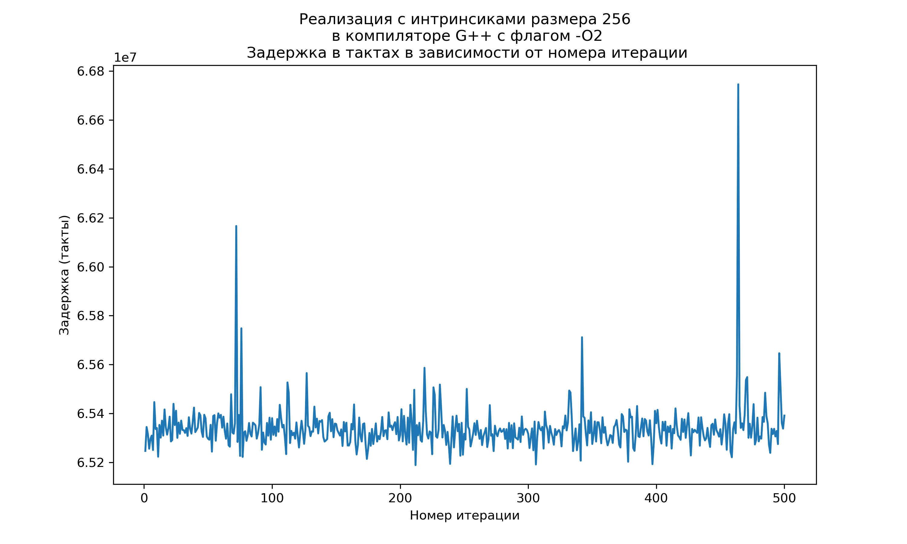
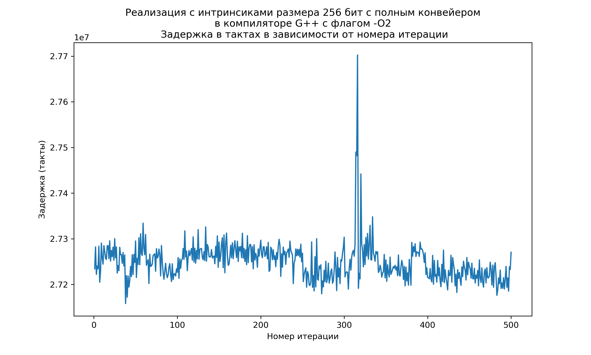

# Множество Мандельброта

## Цель задания

Цель задания заключалась в отрисовке множества Мандельброта и дальнейшей оптимизации вычислений его.

## Определение множества

Множество Мандельброта — множество точек **z<sub>0</sub>** на комплексной плоскости, для которых рекуррентное соотношение **z<sub>n+1</sub> = z<sub>n</sub><sup>2</sup> + z<sub>0</sub>** задаёт ограниченную последовательность. Таким образом, все эти точки не выходят за пределы како-то ограниченной области на комплексной плоскости.

На изображении цвет каждой точки зависит от итерации, на которой элемент последовательности вылетает за пределы характерной окружности, с радиусом которой сравнивается расстояние от точки до начала отсчёта.

Изображение множества на комплексной плоскости:


## Этапы оптимизации

### 1 этап: Базовая версия

Вычисления производились с каждой точкой в отдельности. Она считалась "не вылетевшей", пока лежала в пределах доверительной окружности. Количество итераций было ограничено сверху.

<details>
<summary> Реализация функции на языке C </summary>

```C
MandelbrotError MandelbrotNaive (int* const iteration_stop_arr, const settings_of_program_t settings)
{
    ASSERT ((settings.graphic_mode) && (iteration_stop_arr != NULL), "MandelbrotNative got iteration_stop_arr as null ptr.\n");

    size_t screen_width  = settings.window_width;
    size_t screen_height = settings.window_height;

    float x_base = settings.coordinates_x;
    float y_base = settings.coordinates_y;

    float scale = settings.scale;

    for (size_t y_check = 0; y_check < screen_height; y_check++)
    {
        float y_start = (y_base - (float) y_check) / scale;

        for (size_t x_check = 0; x_check < screen_width; x_check++)
        {
            float x_start = ((float) x_check - x_base) / scale;

            float x_cur = x_start;
            float y_cur = y_start;

            int iteration_stop = 0;

//----------------------------РАСЧЁТНЫЙ--ЦИКЛ------------------------

            for (size_t num_point = 0; num_point < kMaxNumIteration; num_point++)
            {
                float square_x = x_cur * x_cur;
                float square_y = y_cur * y_cur;
                float dub_x_mul_y  = 2 * x_cur * y_cur;

                if (square_x + square_y < kMaxModuleComplex)
                {
                    iteration_stop++;
                    x_cur = square_x - square_y + x_start;
                    y_cur = dub_x_mul_y + y_start;
                }
                else
                {
                    break;
                }
            }

//-------------------------------------------------------------------

            if (settings.graphic_mode)
            {
                size_t ver_index = y_check * screen_width + x_check;
                iteration_stop_arr [ver_index] = iteration_stop;
            }
        }
    }

    return kDoneMandelbrot;
}
```
</details>

### 2 этап: Версия с массивами

Данная версия использует массивы так, чтобы компилятор, при упоминании флага оптимизации `-O2` смог подставить вместо циклов, работающих с массивами, инструкции, работающие с целым набором данных. Проверка данных подстановок была произведена с помощью сайта [Compiler Explorer](https://godbolt.org/#z:OYLghAFBqd5QCxAYwPYBMCmBRdBLAF1QCcAaPECAMzwBtMA7AQwFtMQByARg9KtQYEAysib0QXACx8BBAKoBnTAAUAHpwAMvAFYTStJg1DIApACYAQuYukl9ZATwDKjdAGFUtAK4sGe1wAyeAyYAHI%2BAEaYxBKSXKQADqgKhE4MHt6%2BekkpjgJBIeEsUTFS8XaYDmlCBEzEBBk%2BfuWY9nkMNXUEBWGR0bHltfWNWYNdPUUlAwCUtqhexMjsHCYaAILmAMzByN5YANQmm24KBOi0eBEAdAhH2KsbZtsMu14HR24XLIQKN3cPWx2e0wh2ObBYJAAnn9Nvd1gCnkC3iCPqoWN9BMRgjC4Y9nq93sc8OjggQsQwcQD4YiXsDQSczk5KdT8XSPqdzpdmRt1owfPshJgCI4jApsMRiCQAQB2KzrfYK/YAawAIgJMILhcFgApFXqjir9hpSA89Uq3IYCAB5BKMK1eAgJB0AMToKM2hviMpVRzlPLWBEhtqwVH2p2IXgcYaFIp1AH1UFQ4wlJcBiKwZX69c6AJIBbAAKn2tFQwDjNHovtNitz%2BaL8wI5bdVfh8sVKQAXpg4wR9gB3YLoVB9uMD9AEW6bLPtvBdnv9wfDuMITB4YAIAgttZ6qglpi9hSiStTqnbmdz3toEj4ZgETAKOOqLd6zvdy%2Boa/Bff3uOQrfVhUIg/Wh9jTJgEgQPBkDjCEsH/NsFVJfYWEMLBaAiSVGwAN2iFIBHgs9AOAsMiASZNU3TFh/2lQ0lC1UUEyTFNS0onsCLQBhTn2JClRzBgsLEPB0AAWQwd1DQAWi4LcOK45AEDqItZN7JV7UdF03VCVhxMOMwzDUp0CCuAhVE3PSCK2ENghBNYhCEbAACUABUICuNzplPPkWH2YTUNaDDUAIcVJWITMAOVNUQl8hg0IC3sDSNE1W0I5VPmSTAAHVFz7PVctyhKvQQ1LLQtWgS2QHM73Tdo1glJhIVBQ0zCSlLzUtAJUCYdBnVkPK%2BoSzYWpMGj2IELjX3nJUigANWiO9VHvPqlryhL9kkGSxoPWc32VGa5swBaFBtRxvi7Zb9Q9BUAA4Ns4raL12nxZvqA772O4ltudLwyuUPBbR6Rr9i4AA2Ua7rDbbJt81Qikq6J9zSQGzAAVlBk91mU/Zd06lTodE9BvswDwWASehVEBrgNA0W6uOx/dlVq4g8YwQnidJg7DmRiwpqe/bDpMZHDQS4bueZgn6DZsnSGVMXWdQEmpZlphVHxuWFYO6WlVliX5fZp8RvR/1LMwGgQn2OM1gchy1gATTjZ0rQcuMc1CIQnIcuQ3CcnMrVCCAgPQSFyxIaZzvOgW3HCpb%2BGIfYIEHDmEupqduJixPjkelhnvm%2B9fVTrAn0saxQ85yOiqWkWw6r6uw4jqOw4DoOY7zmvW/y5Gy5SiuRuS6LYsw4KSB8vz0Mwxn6rj0klM27iqoRgQ41OVAyLqMh9kxujYwfRNyJY1h5037UFA8%2BFZXC2z7OcuOIEP0UrjAiCoJgsTQ/MUGzGBye5/aRfSLjVf9hgDAAlUIcgAgBFmLpMwfd/Jjzqg1YAgVZ7wx/kvFeEp9hMF1Awb6IEEhkiuBHBg5gzAeUNuFCaB5kDEEwIwUcQkJwKgSrfHUVwBwxSXGOCcz5zw7UPDQuhK41wbkBiw347ChwjiEeuTc5Cip017KoOMEQsE6TEVcK8xAbzfgfE%2BQ2O49y9iDiopQoiYxHw0R%2BLRX47wPj/HIlKCiwxHjUeYu%2Bh4xCYAIi%2BSGvYE7kyTt4xUMc46UP2EHeSlQlSA2ThYcJcZInIGiR8ZxAiGDLlXDIvOESVxJOsMXcKIt64KicUHU4XRObcz2i9fmgtAZFINtOPKFsra23to7Z2rt3ae29r7OOZShjxS5v4gWQtLoQGMaohUEk44KNDjkqJocAD0zjPEn39NHIeN9fH7CUYk5Jl1Ym7ISbkg5bhUm0PSVwyccS9mnN0lYS6PMs583vOs7uTTlpOKUeU%2BolTnnZ1egoUZ9Sz6NOKblFp1s7YOydi7N2HsvY%2B1CHHH5gzKkjLqQlKAczjn7IefnDmMylEmMwMs1Z9B1kQoMTjPFCx/nVJzsCrFl0Gk%2Bn0WHKFbTYWdIRT05FqKEn0oFhYTFYzDRooqSKsVVLy59VKUK2OIqAWvOZeKw4YL2WfKWlymFHT4XdKRX0iZiqMVpyfCyw0AypXDPNaM2VXc%2BpIUICgtIv9l4Mt5jU3OlqNVWHBclKuITtkPRwSwZMqAkKBJTmGiNUaM5a2VrDb%2BaQ86xqSKSfJlh3m1zPnK86TiFAAEcvB1G7AErmKrvVqtBf6rV1K%2Bq6vaXCrpiLekopviWstj4zUFxBQlPZwrbV9rqUWQdSrh0HXtaeNuhau00N/J6l51b%2B2ss1TwmuTaeUGrbQKztpaF0NWlXa31ESh2ipPYaIsZ6J0XpHSqB1s7DH7AJhER8MFvqLuVYyoFq6hbro5Zuy20Lm28sNe2uOr730sE/Q1XtU7fVmH2GO01x773Ificgc9MqZ2tyQsgEmS7AW1PVWyjd1ct36tbfy41BGEjwYteq/d3aK13oQ0LSwYZ53diPZOxj9IlYqxZjrdWqhpiPtbpRltfKjUdpddVN1aCGP9qLpdOjynBYSZrkhFCCgDmGliQ25pwHuVUZkxBiAunkmqcNOptD7GtMUZM3q6T4G93jo0%2Bq4tB7y2ef2DM7z3beNsf49YY5vyhkhenfm5aUmwO7uNTevzCUoNKJg7QL9fGVNxOtX8%2BzjHHNVzwKGSzWD9NJxzTXIpMWq4YUwEwJU5Gq7DR9DVxULXcPnWK6EtxrCH6QWgrBMlRm/UjZ8Q9HCxA4z%2BMBgspJGH%2BGXPoeOBABK7lRKa2HYNYSM2CGm%2BamJedduNhmykqtTKjuRr2yMou2axvtbzY67TKaF5oP/hgkVk39voYSvJ%2Be6SlMiuO999jm2a5fZu1YVT2rc2tae/lHu8OOtFWRxsxUNCCALAYBFdUMDR6BWonDhEmwvBp1DHFndNHQgPA4LMWgnBka8D8BwLQpBUCcEjrduJCh5iLBRE8HgpACCaFp7MJUIAzBXSuNKZGkhgbIwAJxy4V5sSQyMrrxHpxwSQTORds84LwBQIBjTC5Z7T0gcBYBIDQCTN0ZAKAQBtwkO3IBgBSGahWKqRv/Z64iF%2BYgkJOCC798wAPVoIjaEqKbwXNu2CCCtAwWggezekCwBELwwBSq0CN9wXgWAUJGHECn/ANCqg4Rz6z16WG7xB94KSVoeuLgYTqJCDwWA9dkmJLX0gk2gJKBVJgAvwALhGBF7MXcTAdTTTwJgPsNpGDd/4IIEQnjYgyEEIoFQ6gU%2B6E14YYwWabBN6N5AWYy92g54klaJDEkUJYVUGYXgqBJtYiwCfiAswKhVGcBAVwIxmikCBDWSTD9DxA5CpACD/7ZDJAQEMATB9ClC2CtBR7VCDJQEtBtCoHjDAEIF6ARboG2CDLwHFCgGf685LB6B9iWjHR8T8C1504M664p7s4cC7JXTAwSTAySCgTIDIBAySBXBIYQC4CEBDxbBcDTC8Cm5aDiakDi6bDShXAK5cBmBUzShcAK7SibCqFXTSj6CcA66kDM6s4sGG7G5C5j4W4wCIAgANiGTkCUBO525aRsCcCWzCT7AADibg5yUgghVwle%2BARAr%2BegS%2BwgLia%2BYRm%2Bageuu%2BpAfY6YCQ9B%2BhHAjORheuLBBkDo%2BwiYbBHBXBPBfBfhQhbMduukmwEhUhY%2BYuIAmwmwVwdRjRTRzRKRhhxhT%2BButg5h0houKRj%2B6RzBnRPRshk2eEfgkgQAA%3D%3D%3D)

Измерения показали, что данная оптимизация помогла ускорить процесс почти в 4 раза при использовании компилятора `G++` с флагом оптимизации `-O2`.

<details>
<summary> Реализация функции на языке C </summary>

```C
#define _ARRAY_FOR_INSTRUCTION(body_for)                    \
            for (index = 0; index < kNumVertices; index++)  \
            {                                               \
                body_for;                                   \
            }

MandelbrotError MandelbrotArray (int* const iteration_stop_arr, const settings_of_program_t settings)
{
    ASSERT ((settings.graphic_mode) && (iteration_stop_arr != NULL), "MandelbrotArray got iteration_stop_arr as null ptr.\n");

    size_t screen_width  = settings.window_width;
    size_t screen_height = settings.window_height;

    float x_base = settings.coordinates_x;
    float y_base = settings.coordinates_y;

    float scale = settings.scale;

    size_t index = 0;

    for (size_t y_check = 0; y_check < screen_height; y_check++)
    {
        float y_start [kNumVertices] = {};
        _ARRAY_FOR_INSTRUCTION (y_start [index] = (y_base  - (float) y_check) / scale)

        for (size_t x_check = 0; x_check < screen_width; x_check += kNumVertices)
        {
            float x_start [kNumVertices] = {};
            _ARRAY_FOR_INSTRUCTION (x_start [index] = ((float) x_check + index - x_base) / scale)

            float x_cur [kNumVertices] = {};
            _ARRAY_FOR_INSTRUCTION (x_cur [index] = x_start [index])

            float y_cur [kNumVertices] = {};
            _ARRAY_FOR_INSTRUCTION (y_cur [index] = y_start [index])

            int iteration_stop [kNumVertices] = {};

//----------------------------РАСЧЁТНЫЙ--ЦИКЛ------------------------

            for (size_t num_point = 0; num_point < kMaxNumIteration; num_point++)
            {
                float square_x [kNumVertices] = {};
                _ARRAY_FOR_INSTRUCTION (square_x [index] = x_cur [index] * x_cur [index])

                float square_y [kNumVertices] = {};
                _ARRAY_FOR_INSTRUCTION (square_y [index] = y_cur [index] * y_cur [index])

                float dub_x_mul_y [kNumVertices] = {};
                _ARRAY_FOR_INSTRUCTION (dub_x_mul_y  [index] = 2 * x_cur [index] * y_cur [index])

                int cmp [kNumVertices] = {};
                _ARRAY_FOR_INSTRUCTION (cmp [index] = (square_x [index] + square_y [index] < kMaxModuleComplex))

                _ARRAY_FOR_INSTRUCTION (iteration_stop [index] += cmp [index])

                int mask = 0;
                _ARRAY_FOR_INSTRUCTION (mask += cmp [index])

                _ARRAY_FOR_INSTRUCTION (x_cur [index] = square_x [index] - square_y [index] + x_start [index])
                _ARRAY_FOR_INSTRUCTION (y_cur [index] = dub_x_mul_y [index] + y_start [index])

                if (mask == 0)
                {
                    break;
                }
            }

//-------------------------------------------------------------------

            if (settings.graphic_mode)
            {
                size_t ver_index = y_check * screen_width + x_check;
                for (size_t point_index = 0; point_index < kNumVertices; point_index++)
                {
                    iteration_stop_arr [ver_index] = iteration_stop [point_index];
                    ver_index++;
                }
            }
        }
    }

    return kDoneMandelbrot;
}

#undef _ARRAY_FOR_INSTRUCTION
```
</details>

### 3 этап: Версия с инструкциями **SIMD**

Данная оптимизация заключалась в подстановке вместо операций над массивами - инструкциями **intrinsic**, способными обрабатывать за одну операцию вектор из 8 чисел (использовались 256-битные интринсики).

<details>
<summary> Реализация функции на языке C </summary>

```C
enum MandelbrotError Mandelbrot256 (int* const iteration_stop_arr, const settings_of_program_t settings)
{
    ASSERT ((settings.graphic_mode) && (iteration_stop_arr != NULL), "Mandelbrot256 got iteration_stop_arr as null ptr.\n");

    size_t screen_width  = settings.window_width;
    size_t screen_height = settings.window_height;

    float x_base = settings.coordinates_x;
    float y_base = settings.coordinates_y;

    float scale = settings.scale;

    const __m256 kArrOfTwo = _mm256_set1_ps (2);
    const unsigned int kFullBitsInt = 0xFF'FF'FF'FF;
    const __m256i kMaxInt32U256     = _mm256_set1_epi32 (kFullBitsInt);
    const __m256 kArrMaxModuleComplex256 = _mm256_set1_ps (kMaxModuleComplex);

    __m256 x_base_256 = _mm256_set1_ps (x_base);
    __m256 y_base_256 = _mm256_set1_ps (y_base);
    __m256 scale_256  = _mm256_set1_ps (scale);

    alignas (__m256i) int iteration_stop [kNumVerticesOptimize] = {};
    __m256i iteration_stop_256 = _mm256_load_si256 ((__m256i*) iteration_stop);

    for (size_t y_check = 0; y_check < screen_height; y_check++)
    {
        __m256 y_start   = _mm256_set1_ps ((float) y_check);
        y_start = _mm256_sub_ps (y_base_256, y_start);
        y_start = _mm256_div_ps (y_start, scale_256);

        for (size_t x_check = 0; x_check < screen_width; x_check += kNumVerticesOptimize)
        {
            __m256 x_start   = _mm256_set1_ps ((float) x_check);
            __m256 temp      = _mm256_set_ps (7, 6, 5, 4, 3, 2, 1, 0);

            x_start = _mm256_add_ps (x_start, temp);
            x_start = _mm256_sub_ps (x_start, x_base_256);
            x_start = _mm256_div_ps (x_start, scale_256);

            __m256 x_cur = x_start;
            __m256 y_cur = y_start;

            iteration_stop_256 = _mm256_setzero_si256 ();

//----------------------------РАСЧЁТНЫЙ--ЦИКЛ------------------------

            for (size_t num_point = 0; num_point < kMaxNumIteration; num_point++)
            {
                __m256 x_square = _mm256_mul_ps (x_cur, x_cur);
                __m256 y_square = _mm256_mul_ps (y_cur, y_cur);
                __m256 x_mul_y  = _mm256_mul_ps (x_cur, y_cur);

                __m256 x_square_cmp = _mm256_add_ps (x_square, y_square);

                __m256 sub_square      = _mm256_sub_ps (x_square, y_square);
                __m256 x_mul_y_mul_two = _mm256_mul_ps (x_mul_y, kArrOfTwo);

                __m256 cmp_square_mask = _mm256_cmp_ps (x_square_cmp, kArrMaxModuleComplex256, _CMP_LE_OS);

                iteration_stop_256 = _mm256_sub_epi32 (iteration_stop_256, (__m256i) cmp_square_mask);

                int mask = _mm256_movemask_ps (cmp_square_mask);

                cmp_square_mask = (__m256) _mm256_sub_epi32 (kMaxInt32U256,(__m256i) cmp_square_mask);

                if (mask == 0)
                {
                    break;
                }

                x_cur = _mm256_add_ps (sub_square, x_start);
                y_cur = _mm256_add_ps (x_mul_y_mul_two, y_start);

                x_cur = _mm256_or_ps (cmp_square_mask, x_cur);
                y_cur = _mm256_or_ps (cmp_square_mask, y_cur);
            }

//-------------------------------------------------------------------

            _mm256_storeu_si256 ((__m256i*) iteration_stop, iteration_stop_256);

            if (settings.graphic_mode)
            {
                size_t ver_index = y_check * screen_width + x_check;
                for (size_t point_index = 0; point_index < kNumVerticesOptimize; point_index++)
                {
                    iteration_stop_arr [ver_index] = iteration_stop [point_index];
                    ver_index++;
                }
            }
        }
    }

    return kDoneMandelbrot;
}
```
</details>

### 4 этап: Версия с инструкциями **SIMD** и развёрткой цикла

Данная оптимизация позволила заполнить конвейер независимыми по данным инструкциями, чередуя инструкции, работающие с первыми и с последними 8-ю точками (обработка шла построчно сверху - вниз по экрану, в данной обработке точки брались восьмёрками - по две восьмёрку за одну итерацию цикла).

Развёртка цикла производилась на **4** итерации (таким образом, два подряд идущих набора данных обрабатывались за одну итерацию цикла).

#### Почему именно на 4 итерации?

Я выбрал развёртку именно на 4 итерации из результатов следующего эксперимента:

Я написал 3 функции:
- С развёрткой на 3 итерации цикла
- С развёрткой на 4 итерации цикла
- С развёрткой на 5 итераций цикла

Как показали приближённые значения результатов, определённые с помощью частоты кадров в секунду отображения множества Мандельброта в одном и том же положении картинки, частота кадров в секунду максимальна при развёртке цикла на 4 итерации.

<table>
    <thead>
        <tr>
            <th align="center" >Реализация</th>
            <th align="center">FPS</th>
            <th align="center">Ссылка на Compiler Explorer</th>
        </tr>
    </thead>
    <tbody>
        <tr>
            <td align="center">С развёрткой на 3 итерации</td>
            <td align="center">
            
            </td>
            <td align="center">
            <a href="https://godbolt.org/#z:OYLghAFBqd5QCxAYwPYBMCmBRdBLAF1QCcAaPECAMzwBtMA7AQwFtMQByARg9KtQYEAysib0QXACx8BBAKoBnTAAUAHpwAMvAFYTStJg1DIApACYAQuYukl9ZATwDKjdAGFUtAK4sGe1wAyeAyYAHI%2BAEaYxCBmXAAcpAAOqAqETgwe3r56KWmOAkEh4SxRMXGJdpgOGUIETMQEWT5%2BXLaY9gUMdQ0ERWGR0bEJtvWNzTltCmN9wQOlQxUAlLaoXsTI7BwmGgCC5gDMwcjeWADUJgdu0%2Bi0eBEAdAiX2Dv7ZkcMJ17nl253LEICieLzeh2Op0wFyubBYJAAniCDq89mCPhCflC/qoWIDBMRgkiUe9Pt9flc8LjggQCQwiWDUeivpDodcCPhUPTGaSWX8bndHs9kQzdowfGchJgCI4jApsMRiCQwQB2Kx7M4as4AawAIgJMJLpcFgApNWbLjqzhpSG8zVq3IYCAB5JKMJ1eAhJD0AMToWIOlraKp1lzV%2Bz2BHhrqwVDO02IXgccalMpNAH1UFQ00lFcBiKwVWGzd6AJIBbAAKjOtFQwDTNHoodtmtL5arawI9b9TdR6s1aQAXpg0wQzgB3YLoVBjtMT9AEIVF/t4Icj8eT6dphCYPDABAEHu7M1UGtMUcKUSNg5h5sawfD0doEj4ZgETAKNOqQ9m%2B9rp/EF8z3fNN4UPW8zgiVBPDOPMmCSBA8GQNM4SwMC%2Bw1akzhYQwsFoCJFU7AA3aI0gENCj01SDoOmVAkmzXN8xYMDlUtJQjVlDMsxzWtGJHci0AYaYzkwrUSwYQixDwdAAFkMH9S0AFouEPAShOQBAGirVTRy1d1PR9P1QlYeSLjMMw9K9AgHgIVQDzM8jDhjOYzl2IQhGwAAlAAVCAHj8pYRTFFgzmknCOnw1ACHlRViELcDdX1UKGFwiLRwtK0bV7CiNXtGslAAdQ3MczRKkr0qDdDtQdQQHVoGtkBLN98y6XYFSYeFoUtMxMuyqrHQCVAmHQb1ZFKsb0oOHqTBY/iBCE38dJKAA1aI31Ud8xs20r0rOSQVLm88VwfbVltWzB1oUF1HEBIctvNAMNXifbBMO1dFp8FbGnO98rspI7vS8OrlDwV1%2Bk6s4uAANlml64yOtctVC1QSka6IzwycGzAAVmh683m0s4T0GnSkdk9BAcwDwWCSehVHBrgNA0Z6hKJs9tVa4hSYwCmqZp86LixiwtVOr6LpMLHLXS6aha58n6F52nSG1WWedQanFeVphVDJ1X1fOpXEa1nX5bVvmvxmvGsqCkKwrwgjopIG3kvCgjschgGgZBzB%2Bi8hBiEwTBUeIM4IGpLSDuEpr0YENMaLohoyDOAm2NTD9M3onjWDXFPjQUALUVVcDXPc7yQ4gHPZQeWD4MQ5C5KWUzobMSGQ8INGuljoh44VM4wDAdLQjkAIAhWUyzCSlLXZxj3aGB0HnOASLI/bjJO9otME7OJhTQYQHaDOJIaQecW3AYcwzACy3w16ha42Qf3GFnKSFw1dKK5NB4J2Szc5wXb9lzenfB%2BDAtw7j3GlB679gRfynDObcu59zkWPKeUcqg0wRG3iZKBDx/yATfB%2BL8V9kHEzOPCdBmDwbYNwcEICH5QJX3Aqzc8l4sEplzg8C8YhMBIIAcdXC9RPzg2Fh9M6F1fo3ShFWA4PCNSSWAMwU0EA0zITdngBumE27NVXnHNMXABZCxFmtH6h8/pDnFpLB60tpohiIZqZRLBVHLy0THHRbtdHg2Qg4nGaZTzoFjngN2Zd7GqIrOoqOHcdFcEvjeSqciFEh2CTjNRwlBBOOjiA1x%2BjhEsE%2BkYy6JiJHmPBlYi2S4NSJMhngNJESu5pjcWYDxuI3G%2BP8YEqAFS8ChOqdo2pF8ZFbzuPI7eCSVFJPUakzR6S150QOFkwx318nXSOkUqWhdSngQ6d0lxvTvGzPSp45pg0/FpDaUo0ZlSumTJqevA40SRRmgJhU9mCoVYmz1qoQJ%2BymneLYlwbMijDba25m8s2dysoPIjk8rUHMnRUC8mOVAjSvGQ1jlKP5SRFF9NsRqAmXhBK7hCOgFJOkZ4WCBGJCBloNCqG9N6MAHBaX0sZQy70/8cWQvOVUwFFKDhmDkIE%2B6loDk/LRWmTASQ8C8pDlqUl5LBBguvmaJ5aCMFKDqTjJFbjfn/JDiqzBCqlXnNIeQtVnyHrCpRdqjFIcyGqswAauxRrOH0HVS3TVIqCDosUc6%2B1/Snlvmpu4r5yLUWdmtRAM4yolZnEhtGrG0bpAakmhqbqmo2iag0A68pRqA10QacGrVUodUQC4PGiGiauDJq4Kmrg6aGbRrOAATgbfELNZx/WYEDXs813zLVFvDR8JWZkh3prMNaCGzaIaJA1FwKNM7IYKsYY7cu8NRxkPUtULU4MmbXmNRu5AW6/hAIDiA%2BB4DQx7u3Ae6w1h869SsZVQ1yLjXTF6IK9tvbQ1erLkwhu66r1ajbWaMhr7GjustV4CIxbbWYNdUrEDMwgOagQ2%2Bgt3j8CEWg53XoSsfWusXY%2BzU/Bg4rsAWg/dh6Ho7osGccjAHWTHsfr/RctG0wUdMlYB6/CmCfjvZtB9vVNrKuw40dx4Gv3FuoCghudHN1IdKsJ0DnYGngzQUp3RbKtqKZmGmWZqmROdmUgwwjpU1M6b0WhlFQ0/HhrM70XRStc26PkyVOzon809pDdZ4tbnlOOc7XmlzZpfO6fE952zBndP%2Ba7QRwTY0QsWc81qyDPnIvpr1aanGQXNQhY80Kz9CgUsRfU6mjLw43bZY1CF7t%2BWQ2Fag8VnTyayv4f6ZtBL4mMOpfU%2BmvDFXNPtci3lj9IauuNfs6mvrWWBvxcizVkbbixuKOq7hlhrXjNxYU0a9d6wg0PRQ40GbW3n07eIHU8GB2DzYq09ttju35uXba2NYTyBduJctAlo7JUXu7eG7lr7T7Ankfu/p9T0iNt3QwuEnp683HvYWx6ocipWkaogJVrZGSdkouGxa0NSPUAo5bmjgHmorkw7zbs8TbF8eE5DrFyHhNl2313iwbMqBMLpWo2cFnbOOdXE1sjHwQd0kXp5ykakN7LB8chwJhngONVqYAI5eAaMOeHuOWCA1S69s76W7u6/R/LluIHleq727VtxmvaBYZ1w5vdb3DeOufWgq3IExOWeQlriLtv02nec09u6inTf%2B3Ox7133vftK2B2drFZS5dPJNyrkPOPP3h8UX71NGfHfZud5763ZCVNh698t/XdT4Ol9j/cuXOegex2D8OebGvi%2B6tL811v2f223YUPX0LRfrfhr98mwfHfhOu7IXpvv2v7vl9t7cgPN3c/d6T8OZAgb1efvCyXpfZvfd1%2BX/767DOg/79X3msL6AbNb575nvfZvK8mYX7X7fIfT%2B96S94zfLfn8N/L9/3T9Pq9O9n16tb8Q9186sisr999d8/8okSdjtAkQC/8U8ICGsoC79f9r8R8nUUs/9G8CtICv8e8h9QCG8ADq9R8tcyFXcCAEVzcEcUU08W8x87doUFRYV4VUBsDc8WCaC6CUDLdm8IAXcqCy9nliAOCEVuDa9eCtdaCCd8CQ0mDhC883dk02CJC4UpD58hMjVX8/9sIFAtR6DcdX9ise9X900NDXlKZTZaY3YlY0w3BpJlA0xyw0wnQhBpCNV9Ce9DDjCBDvEzD0CX9A1U1rCjZgVbD3kHD21nDXD3DPDvCW5fD99/C38LcgjA1zCT8u0DYOYbCFZzpYinCXC3DsAPCvCdCxpMJ/DxM4RiJ0jw1Uizd0i4CH9ACypLAGC65Gjt5jDmjA0DD%2Bi6lpdOi7prAeiGjO0RjBi6JhijD/9qjSoydtlYdvFwDksoNxVJUGlQ5oc1iKcUV00zlkVkkWiQ82iO9VjMd1jscqcUsdipV9iV5DjXUxDTjVEG4Ljhx0j79Nstobjpl3jFCtixUJVnigTXFdklZPixkk4hi/CRi58IdACfjkIRj4c4SF0eiQCni9juVBBeV%2BUcZSBsTkkET5ikTFi4DD9Id0S/jwZsSG5cc8SISCSkYeU%2BUHDySG5KTSCMTFj/jOiGTkSmSKkWSCDtj2TpVOSiTuTSTeScVES0jkTyC5c8BYwIA6iLROcxi5dZdxiNR8JMAmAtR4CyoZpwVADo8TCN8L9i0kCe89cesO8/dNiP8HSItZDrd5C7dLt1SGdbTAirMvTvVcDr8o8hs3SK9z9L9mDRC%2BCCcb8lNAzIdbTQTPT4zy4Iz9828wcYzZ84zUsfSRw6CSDUzljXNS8PSUUSBi1RSaSoyfdCy3txN6y5iBS2iZ8HcqzgtYyPcOzFFGyAjmzftWyY92yztOyFjRz7cY80y7oMypyGyVTWjkSxyzsUS48GdB8VyZzqTjCSDZ90drEq87pNSQ5sFq4EIkIUJfUOjNRDSKCCsiB/YvBad2lOVLkDjbi6J00oSscD8dzIdWS3zMAPyTlUdySfzXi/yxDAK7jRiLSlVXySAILPyYKwk4LgTk1EKjiljUTq9b5iIztJx%2BZ0p/1N0zgqwLxgEn55wEAONWMKMUKiMmdV0D52dBA0xyK6ZOcL1xceK%2BKGNslckFlxFlld0hLOw%2BLJcLB9SGdnzxj8KN4e5xYLBSLeLnYvwJYjSJiHpVKLNBYZLtKsBdKbEQLq9VLN4NKtKRLJixLRFjEllbony9L0pVL80TLuLZKdLzE2KVjfzgTbLBZ7KdLmKnLRYXLTFJEzgzAVlDLgqdE9kfLqQzLzoAq6Tq9wrzL5LAqLgrSATzQir%2BNSqnyirwJ/YCB1gGBtQ9QQgJ4XZIpmIQw9gOAVhaBOAsZeA/AOAtBSBUBOA3B5K4w1gNgsQPgeBSACBNAOqVgtRYh4gHhlQsZJBIYsZG11rG0DhJAsZ4g2guqOBJBeq5rBrOBeAFAQBrRZr%2BqOqySYBEAUBTY/QyAKAIA0BqZXqQBgApBuoGwmorqIAIgzqIgaFiB4ROBpqwbmAIanQIhtBqhbrprPq2BBAnQGBaBIa7rSAsAIgvBgBapaArruBeAsBsIjBxAcb8B/YahiISaBrvpXs3wobeBqQOgzqBR8wIaPAsAzqaRKRWbSBSLIIlAdQZjKbjQ5qVgTwmATQlo8BMAxwXRGAhb%2BBBARAuEJBpB1b5AlA1AzrdBDrDBjB5L9B7grrIAVhaIugSaFInQGkFJsJCIPleBUBSKCQsBLa0d2hOgMgXBkoJhWhSBAg5gSgyhchUh0gBAg7I78gMh%2Bhw6hgpgOgkbagZhY6U6/aBAehGhE7BgYgpgM7PAWg9AlN86FhC6VgFBxrNg9AxxHQroxJ%2BBWbOrurTqcahqOBaN4hIYFJIZJAYJkBkBy0Hg9jcBCBHZDgoleBbqtAlgFqQADhlQHhG1q1GZlQuBG1lReUNB4go0jqTrSA%2BqBqu7LrrqZrpaHr4AIAkAOxLJyBKBPqJV6BiAjI2BOBdgPJpIzgABxNwNwUeswB4Rm/AN8qSPQXWzW8QKQGQQQRQFQdQHGo20gMcfMJIVu/Qdu4%2Bs6ruiyD0M4TMHuvugeoekeqQMekOXmV60yA4Gey%2Bu6he0gRag4A4B4VhjhzhrhrB46ju0%2Bi62wC%2Bue%2BanhswPht2gR4Rph0i0iPwSQIAA"> Compiler Explorer </a>
            </td>
        </tr>
        <tr>
            <td align="center">С развёрткой на 4 итерации</td>
            <td align="center">
            
            </td>
            <td align="center">
            <a href="https://godbolt.org/#z:OYLghAFBqd5QCxAYwPYBMCmBRdBLAF1QCcAaPECAMzwBtMA7AQwFtMQByARg9KtQYEAysib0QXACx8BBAKoBnTAAUAHpwAMvAFYTStJg1DIApACYAQuYukl9ZATwDKjdAGFUtAK4sGe1wAyeAyYAHI%2BAEaYxCBmkgAcpAAOqAqETgwe3r56KWmOAkEh4SxRMXGJdpgOGUIETMQEWT5%2BXLaY9gUMdQ0ERWGR0bEJtvWNzTltCmN9wQOlQxUAlLaoXsTI7BwmGgCC5gDMwcjeWADUJgdu0%2Bi0eBEAdAiX2Dv7ZkcMJ17nl253LEICieLzeh2Op0wFyubBYJAAniCDq89mCPhCflC/qoWIDBMRgkiUe9Pt9flc8LjggQCQwiWDUeivpDodcCPhUPTGaSWX8bndHs9kQzdowfGchJgCI4jApsMRiCQwQB2Kx7M4as4AawAIgJMJLpcFgApNWbLjqzhpSG8zVq3IYCAB5JKMJ1eAhJD0AMToWIOlraKp1lzV%2Bz2BHhrqwVDO02IXgccalMpNAH1UFQ00lFcBiKwVWGzd6AJIBbAAKjOtFQwDTNHoodtmtL5arawI9b9TdR6s1aQAXpg0wQzgB3YLoVBjtMT9AEIVF/t4Icj8eT6dphCYPDABAEHu7M1UGtMUcKUSNg5h5sawfD0doEj4ZgETAKNOqQ9m%2B9rp/EF8z3fNN4UPW8zgiVBPDOPMmCSBA8GQNM4SwMC%2Bw1akzhYQwsFoCJFU7AA3aI0gENCj01SDoOmVAkmzXN8xYMDlUtJQjVlDMsxzWtGJHci0AYaYzkwrUSwYQixDwdAAFkMH9S0AFouEPAShOQBAGirVTRy1d1PR9P1QlYeSLjMMw9K9AgHgIVQDzM8jDhjOYzl2IQhGwAAlAAVCAHj8pYRTFFgzmknCOnw1ACHlRViELcDdX1UKGFwiLRwtK0bV7CiNXtGslAAdQ3MczRKkr0qDdDtQdQQHVoGtkBLN98y6XYFSYeFoUtMxMuyqrHQCVAmHQb1ZFKsb0oOHqTBY/iBCE38dJKAA1aI31Ud8xs20r0rOSQVLm88VwfbVltWzB1oUF1HEBIctvNAMNXifbBMO1dFp8FbGnO98rspI7vS8OrlDwV1%2Bk6s4uAANlml64yOtctVC1QSka6IzwycGzAAVmh683m0s4T0GnSkdk9BAcwDwWCSehVHBrgNA0Z6hKJs9tVa4hSYwCmqZp86LixiwtVOr6LpMLHLXS6aha58n6F52nSG1WWedQanFeVphVDJ1X1fOpXEa1nX5bVvmvxmvGsqCkKwrwgjopIG3kvCgjschgGgZBzB%2BhG9ZUeIM4IGpLSDuEpr0YENMaLohoyDOAm2NTD9M3onjWDXRPjQUALUVVcDXPc7zA4gTPZQeWD4MQ5C5KWUzobMSHA8INGuijogY4VM4wDAdLQjkAIAhWUyzCSlLXZxj3aGB0HnOASKw5bjI29otNY7OJhTQYQHaDOJIaQecW3AYcwzACy3w16ha42QYhMEYWcpIXDV0tLk0HgnZLNznBdv2XN7r9vvfbcu59zg1fsCD%2BU4ZzAL3Aec%2B4FWajlUGmCIG8TLgIeP%2BQCb4PxfnPseU8o54QoLQWAlMWdMFQQAsEICH5QLwMqog6%2BYh0HkLLheFh5Efzw1HLheon5wbCw%2BmdC6v0bpQirHtBhvVJLAGYKaCAaZkJuzwLXTCzdmpL2jmmLgAshYizWj9Pef0hzi0lg9aW00Qz4M1EolgKiF6aMjtot2OjwbIXsTjNMp50BRzwG7YudiVEVjUeHVu2iuBnxvJVWR8jA5BJxqo4SghHERwYMvOiZg9FCJYJ9Qxl1jHiLMeDSxFslwagSZDPAqTwntzTK4rJ6UPGuJ8X4gJUBKl4BCTUrRdTT5cM1LEje8TlGJLUSkjRaSMlpgONkgx30CnXSOsUqWecyngU6T05xfSvGzKabiFpg1fFpHaYo0ZVTumTNqSvA4USRRmiGQozp4zRxXN6SvSQczhGiyMUs0xEsSlrOseUs4my3nbJXq4z5%2BzPGQ28UctpONAnnK6aExeEK6KSDuVlM0BNKnswVCrE2etVABJha4tiXBswKMNtrbmxKzbYovri0O%2BKtQcydFQLyY5UDuIOV4yl1LA79JsRqAmXhBK7hCOgZJOlJ4WCBGJNKD0NCqG9N6MAHB1Wau1Vq70v8xWspRZrVQSqDhmDkAE%2B6lpmkCqlFSzASQ8DmsDlqeVirBBMo2ecs4yDUFKHqUi8ldqCBUqSAov1aCmVmnxcQ/1w4yUPVtXCwV4bA5xqjQa0FPqOH0EDY3PlsKo72qFSXS8mAvWVXxW%2Bambjg0pqlKWs4yolZnEhq2rGrbpAakmhqbqmo2iag0NG2xPqa2ZMLRSxtaaIBcE7RDbtXBe1cH7VwQdDNW1nAAJybviCOipY7MC1r2Um/lDbOwzo%2BErMy17B1mGtBDHdENEgai4C219kN93ZthWccdaZoWnqLWxUtBxB0HAfWYJ9ZgX1mHfQ3Vt2MENYoGRqfgAcS48LOMQ9S1QtTgyZteLDaYcPIDw38ABd90kwP3KGIjJGtTWGsDnXqljKoxp9cQ6YvRrWgrPcW0NpbqCENrth7cpGv1mk4zMSdAqvARFLRmgNbslZSd6BJzUqnGgybhfgQiCm269CVrmhNONK29WPI7DD/9kH0fw7RmzYmyNXAo/fb%2Bi5fXEcc6ZKwD0%2BFME/MxzarHzNjXxcgrjjQ3Haf42GhRQnia1wc7h9TpUwsGci1k8G4WZg6KzZtNLEXOyzKy%2BlzsylRVbQKzlz5JXCu5ekXdDU2Xeh1sA64oaviZ3Nci4Ov9kS8tjW652RpbWvEddLUN%2BpSs/0ipBZtSbJ6bV8fG110rMzptHrorcgbpVJsAaW0WlbEa1vdr/chhrjXJu6PrVHOTE21uDsjUp0zO2SqTZGwdild3Vt1f7U9kzn7XtmgW9FhQ33jt1d7f9/NKW3sndB%2BDwOe2lbQ7dmZxrHm6vXdGzpvAemfs5cHcZmHQPNTvei7p%2B7v2jPlpJxV%2Bba3Fu8aLZTgnLXe3E7R6Tpr8Obus4h9VmnLC6fRJC6ljjxH1itctJpuBc3QsS%2BQFLj7RHCvc%2B/QE7DUumey/V7GyXxB/3g11xdu6aWleG%2Bx5aK7eufU2eV7VnLZhbc/vt4bpnC2XcBLd0b9Ke2UNbXBeklxXirfM6nQQIcipEWNwgLDs0QfpkNNB1KKPqAY%2BB3j5qRPIe4VM%2BTfxtPGe4/q5zzsuF%2B3w8hqLycpFJfTdbTQ4HK%2BW8WDZlQJhdKBGLBnFb%2B3zvznaUozCRkWjfeUjUkY5YQLjXgsY/Y67qOABHLwDRhxh4LywQG92Lc6JRwbnRWfxc/s4yvtf0uq9wq37QfTu/B1a8t0fkqaXr8gSizd1/q278qYP/1hvGOCsz9b56lotP9jtd8/sD9ZtwIACJcFAgCE1QDt8Z0H8ps6Nlcn8F9vdkJt9iFMsP9kDwDlcf8ID0d58D1F94DV9gD88%2BMwCkcD8odGDMDR0T9l9qDhxaCi16CIBUDe0%2BCWCKDsDX9iFisCCb8v9tcSDtcyDyDACODfccccCJCiDDdu0fdzt5czc4CEDFDPsvEeDUDu0jDBCNckVkERCjckCVCGDd9jCD9ND7lyCzDG5wtdDkBa0N9lt0BOsIddD792Dz8/8tDKs7dAjgCPCJ0bsjsGCqDz9%2B1T8FDoC2NGt5Dz9IiZlosYiIA3CFD%2BDwjODTC0iIja1K8C9sjcjz97C4jgDHCcVnD8Uwd5Maj18Ed5Mft/Cf8WjD91csCkUmiCiQCbsBiOikiujdDkixdQif0BjuiuCvt2i/C8jxi8iiic07tuiyi%2BMRiliqiViqjZD58X9cDlCRweUL9N9CCGDLDB12UFROVuVUA1jF9LDX8CBziVdLibCcjTi8CDYOUuUeVnjhCTi3jzj5iDCrifjLDe07jiAHigTejWCQSb9iEwT08tjuCoSLCTju04SESniA9YCf0MjujsIFAtQLi%2BMMjRj0jPD/jCUjZ6VKZTZaZlNQU3BpJlA0xyw0wnQhBgSkVSTdDyTKTPjqTa1aSSjMkGTOYmS5YWSSV2S0xOTuTeT%2BTBTG5hSFDRTMibsaTdjpT1sCU5S6UFSFZzplTVSeTsA%2BSBSkShChTa0ySN5KTMTXEDTYj3DSjZSiVFSzYrSuSbS7TDiMdMJRTQDUBiJdSZ1tTz9dT%2BsUjnDxpLBL9q5ozXTS04zgDdT%2BkkzkyypUzN8oyj1MzYznSRTMztt8yCzNRrA0y4QMyKSsyKydTMy6jmVnCy9IVQ82i0xHVnUskg4R8MV8098RlYUklszhwEzTDuzMkvFxSgM7sByXVhz0Vg9y80CzlJza5pzkJMzJjkz5yxyISU0VynU1yTzXFe0dyVE9zWz4yqy5yRzNyeyK8%2BzVyhzryvFu07yxl45Hycz2zQzGt9yEzwZ/zP00yBivzXUkYzULVlMoKklAK6IXTmzgiYCwKgKZzDzILKla4C9YLLyhzaVELLUcZSAULa40LBjczTDwKqyCLzkiLtiLzBz4KtYKLkLnkxVcKDzmztt6ccL0LKzmzK8oK2Llz5M4KIByLBBzVKL20aL%2BKxK2yJLQK7o8BYwIAIyLQu8Z9yC59ayIJb4mAGMRK7orEnDyCfcvDDsfDS1ZjOjMdCdTDUCHL2snLVtXjt93j08AjCstKtofclzvLfDm8NiJj99fsPKoCsifLjs/Kb8Aq0DZcQqGdd8zzV4kqormjdCmDId4rsrErIroTQT/LwSuiZhMrBsHCyrnLoqFD1CTsSqpd3Sxs8qKrUTTi0rqjaqiTLtf9osSAWz1KnzML98792rLdRrDdyyJrgKpr0DH8hq7owr5rxr6LDzpqMCHTVqhilCxrFqdrmyEioC6rdtGCtrTqMLKSmDsrZq9TjqFqFEmKhLpD3crq4c7Dbr3qBLdTWq7DnrOq4UTqAalq8KJKvr/0n8bL6jtLdKMEK4EIkIUIK1sLto84azQttiiBb4vBi8ULLlXzplB0fy4UsLcbUt8aSBMAiba9Y8Sa0UnE3yZStl2axyjyGi6bCbibOlSaNzple1KaZkii%2BaGaBaUUha2bplu0xaOysator5iJDdJx%2BZ0pRNcMzgqwLxAF0k3NvMPN6MDqm8rNjoJ9BA0wNa6Yu9aMrbOxbbWQTpvl8kxFllCNHabbnYvxLAmNlagscapiwyybtE15xYLA1afasAvwAVTKgsHoTzrtBZvbbazEDqE8w66kI7BZo7nb6yck8kFkPbbo6yAV0pry9E07faM6rL58Tzc6o7ogY7NbUyi6RFfkTEJEzhncK6k7s6blq6O9rb06JZM7s9B6O4A5I787fbjaO6flFlu7dazgDgVkB7hbtFoVU6R6nba7x766Mc57Y6p8fMQig6QwaaLgZp8yEaWNb7OyNRb4CB1gGBtQ9QQhR4XZIpmIr7dgOAVhaBOAsZeA/AOAtBSBUBOA3Az64w1gNgsQPgeBSACBNBAGVgtRYh4gHhlQsZJBIYsYt0CGt0DhJAsZ4g2hgGOBJAwH0GoHOBeAFAQBrQ0GIHAHqKYBEAUBTY/QyAKAIA0BqY%2BGQBgApBuoGwmpmGIAIh6GIgaFiB4ROAUH5HmBFGnQIhtBqg2GUGhG2BBAnQGBaAlH2HSAsAIgvBgBapaBmHuBeAsBsIjBxBTH8Bb4ahiJbHIHvolc3xlHeBqQOh6GBR8xFGPAsB6GaRKQ/HSA1bIIlAdRSynHjR0GVgTwmATQlo8BMAxwXRGBon%2BBBARAWEJBpACn5AlA1B6HdAqHDBjAz79B7hmHIAVhaIuhbGFInQskFJsJCJSVeASyFQpJ3x4AVgqgahnAIBXAJhWhSBAg5gSgyhchUh0gBBpmln8gMh%2BgFmhgpgOhtHagZg1ndnOgDnegtnBgYgphDnPAWg9BCtzmFhLnRmEHNg9AxxHQroxJ%2BA/GgGQG6HTHoGOBfV4hIYFJIZPlgBkBkAF0HghzcBCBHZDhIleA2GtAlhMGQADhlQHgt0V1GZlQuAt1lRzUNB4gW1qHaHSBwHIHAWmGWHUGUnOH4AIAkAOxLJyBKAhGnV6BiAjI2BOBdgPJpIzgABxNwNwGFswB4Lx/AAmqSPQMpop8QKQGQQQRQFQdQUx6p0gMcfMJIH5/QP5ql%2BhwFiyD0M4TMYF0F8FmCKFyVwOXmPh0yUDJYFFlJjFg4A4B4T1n131v1w1mh/5mlxh2wel1FjBgNswIN/pkN8N9FmJkiDIEASQIAA%3D%3D"> Compiler Explorer </a>
            </td>
        </tr>
        <tr>
            <td align="center">С развёрткой на 5 итерации</td>
            <td align="center">
            
            </td>
            <td align="center">
            <a href="https://godbolt.org/#z:OYLghAFBqd5QCxAYwPYBMCmBRdBLAF1QCcAaPECAMzwBtMA7AQwFtMQByARg9KtQYEAysib0QXACx8BBAKoBnTAAUAHpwAMvAFYTStJg1DIApACYAQuYukl9ZATwDKjdAGFUtAK4sGe1wAyeAyYAHI%2BAEaYxCBmAOwAHKQADqgKhE4MHt6%2BeqnpjgJBIeEsUTHxSXaYDplCBEzEBNk%2Bfly2mPaFDPWNBMVhkdGxibYNTS257Qrj/cGDZcOVAJS2qF7EyOwcJhoAguYAzMHI3lgA1CaHbjPotHgRAHQIV9i7B2bHDKdeF1du9xYhAUz1e7yOJzOmEu1zYLBIAE9QYc3vtwZ9Ib9of9VCwgYJiMFkaiPl8fn9rng8cECISGMTwWiMd8oTCbgR8KgGUyyaz/rd7k8XijGXtGD5zkJMARHEYFNhiMQSOC4lZ9ucNecANYAEQEmClMuCwAUmrNVx15w0pHeZq1bkMBAA8slGE6vARkh6AGJ0bGHS3tFU6q5qg77AgI11YKjnGbELwOOPS2UmgD6qCoaeSSuAxFYKrDZu9AEkAtgAFTnWioYBpmj0UO2zWl8tV9YEet%2Bpto9Wa9IAL0waYI5wA7sF0Kgx2mJ%2BgCMKi/28EOR%2BPJ9O0whMHhgAgCD29maqDWmKOFKJG4cw82NYPh6O0CR8MwCJgFGnVIezfe10/iC%2BZ7vmmCKHre5wRKgnjnHmTDJAgeDIGm8JYGBfYajS5wsIYWC0BESqdgAbtE6QCGhR6apB0EzKgyTZrm%2BYsGBcSWkoRpyhmWY5rWjEjuRaAMDM5yYVqJYMIRYh4OgACyGD%2BpaAC0XCHgJQnIAgjRVqpo5au6no%2Bn6oSsPJlxmGYelegQjwEKoB5meRRwxvM5x7EIQjYAASgAKhAjx%2Bcsoriiw5zSThnT4agBAKkqxCFuBur6qFDC4RFo4WlaNq9hRGr2jWSgAOobmOZolSV6VBuh2oOoIDq0DWyAlm%2B%2BbdHsipMAiMKWmYmXZVVjoBKgTDoN6silWN6WHD1JgsfxAhCb%2BOmlAAatEb6qO%2BY2baV6XnJIKlzeeK4Ptqy2rZg60KC6jhAkOW3mgGGoJPtgmHaui0%2BCtTTne%2BV1Ukd3peHVyh4K6AydecXAAGyzS9cZHWuWqhaopSNdEZ6ZODZgAKzQ9e7zaecJ6DTpSOyeggOYB4LDJPQqjg1wGgaM9QlE2e2qtcQpMYBTVM0%2BdlxYxYWqnV9F0mFjlrpdNQtc%2BT9C87TpDarLPOoNTivK0wqhk6r6vnUriNazr8tq3zX4zXjWVBSFYV4QR0UkDbyXhQR2OQwDQMg5gAy%2BsRqPEOcEA0lpB3CU16MCGmNF0Y0ZDnATbGph%2Bmb0TxrBronxoKAFaKquBrnud5gcQJncqPLB8GIchcnLKZ0NmJDgeEGj3RR0QMeKucYBgOloRyAEASrKZZhJSlrs4x7tDA6DznAJFYct5kbe0WmsfnEwpoMIDtDnMktKPOLbgMOYZgBZb4a9QtcbIMQmCMLOUkLhq6WlyajwTslm5zgu37Lm91%2B33vtuXc%2B5wavxBB/KcM5gF7gPOfcCrNRyqDTBEDeJlwGPH/IBN8H4vzn2PKeUcCIUFoLASmLOmCoIAWCEBD8oF4GVUQdfMQ6DyFlwvCw8iP54ajlwg0T84NhYfTOhdX6N1oRVixlwzUklgDMFNBANMyE3Z4FrphZuzUl7RzTFwAWQsRZrR%2BnvP6Q5xaSwetLaaIZ8GaiUSwFRC9NGR20W7HR4NkL2JxmmU86Ao54DdsXOxKiKxqPDq3bRXAz43kqrI%2BRgcgk41UcJQQjiI4MGXnRMweihEsE%2BoYy6xjxFmPBpYi2S4NQJMhngVJ4T25plcVk9KHjXE%2BL8QEqAlS8AhJqVoupp9pEaliRveJyjElqJSRotJGS0yHGyQY76BTrpHWKVLPOZTwKdJ6c4vpXjZlNLxC0wavj0jtMUaMqp3TJm1JXocKJoozRDIUZ08Zo4rm9JXpIOZwjRZGKWaYiWJS1nWPKecTZbztkr1cZ8/ZnjIbeKOW0nGgTzldNCYvCFdFJB3Kyg8%2B4cjhlnNhUk9RYT3l0Sxl83JIjfkmMwCsixQLf4VJRVs9JLivEUphYcoaiLG4dJRZc0lGK0xY2xRfM0BNKns0VCrE2etVABK5V4tiXBswKMNtrbmcqzZivApK850riBOioF5McqB3EHOVdKVVyQFH9JsRqAmXhBK7hCOgZJOlJ4WGBGJNKD0NCqG9N6MAHAg0hrDaG70TL46h02Rq31hwzByACfdS0zSrUEFVZgZIeBE2By1F6n1ghdWVSlcg1BSh6lIqVXClVarA7lrQWKs0UriEVuHIqh66ba3WvrRANtTbo1So4fQKtjcLWwqjr221gcR2YBLb1KVb5qZuJrVOzsM6IDnDiErc4kNd1Y13dIDUk0NTdU1O0TUGhm22INcuzJE7XFsT7VwQ9ENj1cFPVwc9XBL0M13ecAAnABhIN7mWwvOPemZj6M19s%2BErMyCHL1mGtBDYDEMkgai4DurDkMwOgrvZgFd0Ku2Wp7RuhRhxL2HFQ2YdDZhMPxAQ/us9b7zhmCxUOwjK7OWkcnc%2Bzdhx0OHEw4cHDhwWOHDfYcY95xDinrk/a6JvV%2BABxLjw84xD1I1C1ODJm15NNpm08gXT/wAF33STA/coZDPGa1NYawOdeqWMqi2g1xCZh9FTaCsj66bUKOoIQ2uWntwmfw2aDzswYO1q8BEPtA7K1uyVpFvo4XNQpaaNFtM%2BBCLxbbn0JWc6x0Ls2qp2dGnkF2b0zZyroXTPXHM/fb%2Bi5zi1Z06ZKwD0%2BFME/E5zaLneqbTLflpobist1s3YF4mtc2thejUNg1yDPOjayeDJbswdHzbGsN5bnZZlrZG52ZSDqto7Y258g7u3NsnYWxB9bfQRXPwevd0bx3lN3Q1C9o7WWhq%2BM3V9nRSsoORK26VAHjS%2BOuN%2B328HQOiOZLS2Dw70G13Q/%2B8j09UHbmg5KgDkjabfNo4UXjuHxHEe4%2BR7xgnk6icNsp6T8lJWPsA90WuhQsWYfI8vY2xLONydmnB%2BNjn6Orvnp5x2vnOOBcY6F3FkXG3T3i%2BK1LzUePZec6u8epXbt%2Beq8p%2Br%2BXD233a8lwwwbY0WdZZyxrjbl6is65V595HEPqeuOt4blbhXLwS7w471rMu13u%2BJxjr3LDlc3Yt8j/HPnJ1B7p5r0Po6HcR6R1dqnMe3d4Fyx7zsb77em/ex91tRmNiroehluBILbsBK06Xl3hndt%2B%2BL8gUvezy%2BHab%2B5kvxA0zR4r53iDtee/p/72bj7BG7vd7L5aFnA%2BAmVbr5djbZg59IoXz3tvM%2BMer8buv3vS%2BHt7RTyVYbLfh8H9G1IsfH3wVsp2XC1nkOM1DiVLywOuuMJCrv5Crx9fu3rpf1QDfwgA/1ZWmVcU3wz2f2iCAJOSRRAL91v3AK8Wj3/zYkAOANAKQPZThXTzQOlAwLgL5SZzujK3U3/i3hYGzFQEwnSn0wsHOEoOoNoIaw1RRi/xsyYNSBpAc0sD6w%2BwG3Hzc0nwUAAEcvBGhhxH9XcvEWBAZOcz9Ad/dFCQdj9q8kUPNxDJDp8oC4U5DaA8sVDksp9VCq8i9FtkJ5DiFdEst9CFDS9L0h8dESChCdstDb56lbD5D0dFCxcp8lNwJx9i8xCJCPC/9fM7DN0nDz1ojQDhD59LCDDiFVs11Ijg9fDjDfCXCgiLCQjtDID/80i6dFDFcp9sc1Dtsu88iPCCiIjvCFEnDT1Gi4jb1J87DiF9tUj6jijW9MjW9sjzCRD3DhxUC6iDCfDS8tcp9OMKjSpgjhj98ujxiGjpi%2Bie8ZizC7pht2j98vDliej1i1je8BitjciFi8Cxj7Dh8lY99RU/d4iNCo5zi9jDDS830nC7jZiT8LCdiKUXiJjrjbM3iTjTszjQjhxkAV1pDdDV50A/tg9qipDjDETnD7jWiEiUTISH1Uc4SNcFiYinjwT6kWjwMMSFisSUcn84VacIAlsFimjCT8iSSJ8ySiSKTRiadcSRcFjj1NCiSNjAjBjWTtCKSLjOT4T49zjkTziQT1DG52c4sUToS0DhcESFjHDGSPDTDBTTiIMFTNSO0Dc1SiSCSUSAjXMhSkV9SUTaj%2BNVTJSiSGSbTmTh0OcUSOSn17TaSDTe9pT%2BSXSDVrTni2cvS6SiT3ifTPjC8hCWS19EiQJ4yCAzUdDCjujvSdjL0tQOZjVTVUAAy2irDEzkzwjJ0ij0zCzz0szFQcyzV8yEidi7CkygDbTXEyzkEdjT0qyjUTVay0TSS4yGz5CmzFiqT4z0cdjj0uyay8y%2BzYzd94ziFGzkyxTWy0z2zCy30pyeyZzr8YypUKSUTsIFAtQUzfMKTuS2SoSDYOZZVKZTZaYktQU3BpJlA0xyw0wnQhA6ykUDyFijyTySzXFzzjSRSV1KybyjYtU7z5VHy0xnzXz3zPzvzG5fyiT/zKSZC4VgKHTQK6JOyILNU5ZoKzZYL4K3zsAPyvzZz9yV1DyN4TyPSvFsLvTMTiNryZVIKiKFZzpSKXzyLKLkL45aK/z6LHs11mKwzcKRV2LOZOLdYSKcYlY4K%2BLEKqLdyhDMJ/zbDUBiJ0LN1ULtD0KQcLSYz%2BtLAYT4RdLRL9LhK0LRL%2BkTLTLtpzLCidKiNrKFEDKPD0LsdHKnLzQXKIi3K9LPLbLDLRLOM/L/Ln5ArSzgqPLA4vLhx0Koz7lTLsD79Ty7S4ts1c0skg4v9kCH8lZCUVFa4krkJRLtSorSoMqf84VALlUOdcq80Cr0Vv9Mlf8SrnkhK6I6LjziTZy6rOq4UWymqcqc1Wrhqx0ZluqUVyqwrvLRLyjNitppqoV1cWr8r1qUC5qiUFq%2BqRKBqBSaqSodrcDNrJrtrCqcDpKRl9reqfSUrZSxoKqjLwZSq%2BcYT9Str80kYE0k0ktPqqla5Hr%2BqTzqrzc7o3r7KPrKla4VSJq8q/qtYAbk1FLgakkwajqALmSYaBrIDgaEbfMfqrqUbVA0agaersa7KCa8bFrkqIq4bzlibsq0xfqIB41BBE10b91MbQb8aGL6bDraaTz08ibvrmqybOb/rubAaMbqbBaRUXrarYwIAtKLQ6D%2BCYzBDoqIJb4mB7MvjzQZocVTK99lTCcuSFEgyiTucudmSnDLbxTOdByDDhyNTdsVaKdfCftrbZ03T8SbjndHb/C/aJTyykiiygDTTZhvbpcSjw6%2B1bb8jg6rsVqdStpGik7xzCylzmzkS46BkhC99GLqT/aS5A7%2BS07ztQ7FCy7YSI71yo787fSG8i71Lx9bic6baq7tDjdKc663ie66c3aRxlzC7Uti6u6TCssSA%2B0lb7aVCh6e9nbXF56bKRbwqBqNTl7p7mcw610N7Qqt6lqBq/CsjZzoi56e9N6nr7KjjzTxVzayib6F6GbKqCbg6SiV6MKYTj7EqP6fKjiM6zaYzS63677wa27S7f6G6AGIAlbeTpj469dFCVyvEEGlaB70Hf6MG4UsGgHRKIzcG/crE0q7o8A1aMEK4EIkIUJ51M6TbVqhsSaiBb4vBgDMbBV2rplL1zrUTjbbE2GSBMBOGiDkUiUeGnEOr6klYBGn6nK0D2GxGuHOlpGpltFT0BHQGobTsRGOG1GBU0UZHplj0BGTq9HWH%2BMVHxH/F4DuGTHNG6k30BHUqwGhCr5iIe9Jx%2BZ0oQt2sqwLxAF0lmsOtlC6tZyyCr5uDBA0xfG6Y6CbNYnOwEm2QTpvl8kxFlkDMUn4nnYvxLBHMmHxo85TrNppq15xYLBvH8msAvwAU9b%2BsHpprWdBY8mEmzFZyzRKnO5qnam0nrAMmqUflFlaVzQAV0p1q9EOmCmumhHaqbq6kqnBYBmCnwmck8kFlsnboqwV9JmWmlmbkZmaC4nOmJZunNRemA5%2Bnog6m/HzLNnqUxnxFzgqxDh6VLRproV2nTnUm5mLmFmzqjmO4bnVm7nBnHn5lRFCkjo3ndpPmwDtFOVfmaR7mGngUSm7o1n6neDOsWHSmQxTryHHKSXnNTbn6NRb4CANgGBtQ9QQhR4XZIpmIiW9gOBVhaBOAsZeA/AOAtBSBUBOA3A8W4x1hNhsRPgeBSACBNAOXVgtRYgEhHg4gsZJBIYsZAN1XAMZMsYEh2guWOBJBeW5XBXOBeAFAQBrRZX%2BWOXSA4BYAkA0BqY/QyAKBEHTZXWQBgApBuoGwmpLWIAIhTWIgaFiAEROBpXQ3mBw2nQIhtAagbXpXnW2BBAnQGBaAI3bXSAsAIgvBgBapaBLXuBeAsBsIjBxBs38Bb5ahiJi2BXvoW83xI3eAaROhTXBR8xw2PAsBTXaQqQW3SBvHIIlAdR3KK3jQ5XVgTwmATQlo8BMAxwXRGBB3%2BBBARAWEJBpA135AlA1BTXdADXDBjA8X9AHhLXIBVhaJuhi2FInQskFJsJCIFVeA3LFQpJ3x4BVhqhahnAIBXBJg2hSBAh5hShyg8g0gMgBBAOIOChMgBgwPhhphOhE26hZgYPkOug0O%2BgEOhgYhph0PPBWg9BdtcPFh8Pv3xWtg9AxxHQroxJ%2BAW3OXuWTXs2hWOBWsEhIYFJIZPlgBkBkB31Hh8rcBCBHYjhIleAbWtBlgFWQAxNHhANv1GY4guBAM4hE0NAEgd1DXjXSA%2BWBX2OLWrWZWp37WYBEAQAOxLJyBKBnWc16BiAjI2BOA9gPJpJzgABxNwNwITswR4Bt/AdhqSPQHdjd8QKQGQQQRQFQdQbNw90gMcfMZIJj/QFj/T019jiyD0c4TMTj7j3jmCATvzwOXmV10yKjZYKTqduT%2BTR4eTBrxrprtLo11jwz812wEz6T%2BVlrswNr19jr7r2TodkiTIEASQIAA%3D%3D"> Compiler Explorer </a>
            </td>
        </tr>
    </tbody>
</table>

#### Почему это происходит?

При большом количестве инструкций SIMD количества широких регистров процессора перестаёт хватать на все операции, поэтому появляется потребность сохранять значения этих регистров в локальных переменных между инструкциями, из-за чего производительность кода уменьшается, так как доступ к памяти будет дольше, чем доступ к регистрам.

<details>
<summary> Реализация функции на языке C </summary>

```C
enum MandelbrotError Mandelbrot256FullPipeLineFourIter (int* const iteration_stop_arr, const settings_of_program_t settings)
{
    ASSERT ((settings.graphic_mode) && (iteration_stop_arr != NULL), "Mandelbrot256FullPipeLine got iteration_stop_arr as null ptr.\n");

    size_t screen_width  = settings.window_width;
    size_t screen_height = settings.window_height;

    float x_base = settings.coordinates_x;
    float y_base = settings.coordinates_y;

    float scale = settings.scale;

    size_t delta_x = kNumVerticesOptimize * 4;

    alignas (__m256i) int iteration_stop_1 [kNumVerticesOptimize] = {};
    __m256i iteration_stop_256_1 = _mm256_load_si256 ((__m256i*) iteration_stop_1);

    alignas (__m256i) int iteration_stop_2 [kNumVerticesOptimize] = {};
    __m256i iteration_stop_256_2 = _mm256_load_si256 ((__m256i*) iteration_stop_2);

    alignas (__m256i) int iteration_stop_3 [kNumVerticesOptimize] = {};
    __m256i iteration_stop_256_3 = _mm256_load_si256 ((__m256i*) iteration_stop_3);

    alignas (__m256i) int iteration_stop_4 [kNumVerticesOptimize] = {};
    __m256i iteration_stop_256_4 = _mm256_load_si256 ((__m256i*) iteration_stop_4);

    const __m256 kArrMaxModuleComplex256 = _mm256_set1_ps (kMaxModuleComplex);

    const __m256 kArrOfTwo = _mm256_set1_ps (2);
    const unsigned int kFullBitsInt = 0xFF'FF'FF'FF;
    const __m256i kMaxInt32U256     = _mm256_set1_epi32 (kFullBitsInt);

    __m256 x_base_256 = _mm256_set1_ps (x_base);
    __m256 y_base_256 = _mm256_set1_ps (y_base);
    __m256 scale_256  = _mm256_set1_ps (scale);

    __m256 temp_1 = _mm256_set_ps ( 7,  6,  5,  4,  3,  2,   1,   0);
    __m256 temp_2 = _mm256_set_ps (15, 14, 13, 12, 11, 10,   9,   8);
    __m256 temp_3 = _mm256_set_ps (23, 22, 21, 20, 19, 18,  17,  16);
    __m256 temp_4 = _mm256_set_ps (31, 30, 29, 28, 27, 26,  25,  24);

    for (size_t y_check = 0; y_check < screen_height; y_check++)
    {
        __m256 y_start    = _mm256_set1_ps ((float) y_check);
        y_start = _mm256_sub_ps (y_base_256, y_start);
        y_start = _mm256_div_ps (y_start, scale_256);

        for (size_t x_check = 0; x_check < screen_width; x_check += delta_x)
        {
            __m256 x_start_1  = _mm256_set1_ps ((float) x_check);
            __m256 x_start_2  = x_start_1;
            __m256 x_start_3  = x_start_1;
            __m256 x_start_4  = x_start_1;

            x_start_1 = _mm256_add_ps (x_start_1, temp_1);
            x_start_2 = _mm256_add_ps (x_start_2, temp_2);
            x_start_3 = _mm256_add_ps (x_start_3, temp_3);
            x_start_4 = _mm256_add_ps (x_start_4, temp_4);

            x_start_1 = _mm256_sub_ps (x_start_1, x_base_256);
            x_start_2 = _mm256_sub_ps (x_start_2, x_base_256);
            x_start_3 = _mm256_sub_ps (x_start_3, x_base_256);
            x_start_4 = _mm256_sub_ps (x_start_4, x_base_256);

            x_start_1 = _mm256_div_ps (x_start_1, scale_256);
            x_start_2 = _mm256_div_ps (x_start_2, scale_256);
            x_start_3 = _mm256_div_ps (x_start_3, scale_256);
            x_start_4 = _mm256_div_ps (x_start_4, scale_256);

            __m256 y_cur_1 = y_start;
            __m256 y_cur_2 = y_start;
            __m256 y_cur_3 = y_start;
            __m256 y_cur_4 = y_start;

            __m256 x_cur_1 = x_start_1;
            __m256 x_cur_2 = x_start_2;
            __m256 x_cur_3 = x_start_3;
            __m256 x_cur_4 = x_start_4;

            iteration_stop_256_1 = _mm256_setzero_si256 ();
            iteration_stop_256_2 = _mm256_setzero_si256 ();
            iteration_stop_256_3 = _mm256_setzero_si256 ();
            iteration_stop_256_4 = _mm256_setzero_si256 ();

//----------------------------РАСЧЁТНЫЙ--ЦИКЛ------------------------

            for (size_t num_point = 0; num_point < kMaxNumIteration; num_point++)
            {
                __m256 x_square_1 = _mm256_mul_ps (x_cur_1, x_cur_1);
                __m256 y_square_1 = _mm256_mul_ps (y_cur_1, y_cur_1);
                __m256 x_mul_y_1  = _mm256_mul_ps (x_cur_1, y_cur_1);

                __m256 x_square_2 = _mm256_mul_ps (x_cur_2, x_cur_2);
                __m256 y_square_2 = _mm256_mul_ps (y_cur_2, y_cur_2);
                __m256 x_mul_y_2  = _mm256_mul_ps (x_cur_2, y_cur_2);

                __m256 x_square_3 = _mm256_mul_ps (x_cur_3, x_cur_3);
                __m256 y_square_3 = _mm256_mul_ps (y_cur_3, y_cur_3);
                __m256 x_mul_y_3  = _mm256_mul_ps (x_cur_3, y_cur_3);

                __m256 x_square_4 = _mm256_mul_ps (x_cur_4, x_cur_4);
                __m256 y_square_4 = _mm256_mul_ps (y_cur_4, y_cur_4);
                __m256 x_mul_y_4  = _mm256_mul_ps (x_cur_4, y_cur_4);

                __m256 x_square_cmp_1 = _mm256_add_ps (x_square_1, y_square_1);
                __m256 x_square_cmp_2 = _mm256_add_ps (x_square_2, y_square_2);
                __m256 x_square_cmp_3 = _mm256_add_ps (x_square_3, y_square_3);
                __m256 x_square_cmp_4 = _mm256_add_ps (x_square_4, y_square_4);

                __m256 sub_square_1 = _mm256_sub_ps (x_square_1, y_square_1);
                __m256 sub_square_2 = _mm256_sub_ps (x_square_2, y_square_2);
                __m256 sub_square_3 = _mm256_sub_ps (x_square_3, y_square_3);
                __m256 sub_square_4 = _mm256_sub_ps (x_square_4, y_square_4);

                __m256 x_mul_y_mul_two_1 = _mm256_mul_ps (x_mul_y_1, kArrOfTwo);
                __m256 x_mul_y_mul_two_2 = _mm256_mul_ps (x_mul_y_2, kArrOfTwo);
                __m256 x_mul_y_mul_two_3 = _mm256_mul_ps (x_mul_y_3, kArrOfTwo);
                __m256 x_mul_y_mul_two_4 = _mm256_mul_ps (x_mul_y_4, kArrOfTwo);

                __m256 cmp_square_mask_1 = _mm256_cmp_ps (x_square_cmp_1, kArrMaxModuleComplex256, _CMP_LE_OS);
                __m256 cmp_square_mask_2 = _mm256_cmp_ps (x_square_cmp_2, kArrMaxModuleComplex256, _CMP_LE_OS);
                __m256 cmp_square_mask_3 = _mm256_cmp_ps (x_square_cmp_3, kArrMaxModuleComplex256, _CMP_LE_OS);
                __m256 cmp_square_mask_4 = _mm256_cmp_ps (x_square_cmp_4, kArrMaxModuleComplex256, _CMP_LE_OS);

                int mask = _mm256_movemask_ps (cmp_square_mask_1)
                            + _mm256_movemask_ps (cmp_square_mask_2)
                            + _mm256_movemask_ps (cmp_square_mask_3)
                            + _mm256_movemask_ps (cmp_square_mask_4);

                iteration_stop_256_1 = _mm256_sub_epi32 (iteration_stop_256_1, (__m256i) cmp_square_mask_1);
                iteration_stop_256_2 = _mm256_sub_epi32 (iteration_stop_256_2, (__m256i) cmp_square_mask_2);
                iteration_stop_256_3 = _mm256_sub_epi32 (iteration_stop_256_3, (__m256i) cmp_square_mask_3);
                iteration_stop_256_4 = _mm256_sub_epi32 (iteration_stop_256_4, (__m256i) cmp_square_mask_4);

                cmp_square_mask_1 = (__m256) _mm256_sub_epi32 (kMaxInt32U256,(__m256i)  cmp_square_mask_1);
                cmp_square_mask_2 = (__m256) _mm256_sub_epi32 (kMaxInt32U256,(__m256i)  cmp_square_mask_2);
                cmp_square_mask_3 = (__m256) _mm256_sub_epi32 (kMaxInt32U256,(__m256i)  cmp_square_mask_3);
                cmp_square_mask_4 = (__m256) _mm256_sub_epi32 (kMaxInt32U256,(__m256i)  cmp_square_mask_4);

                if (mask == 0)
                {
                    break;
                }

                x_cur_1 = _mm256_add_ps (sub_square_1, x_start_1);
                y_cur_1 = _mm256_add_ps (x_mul_y_mul_two_1, y_start);

                x_cur_2 = _mm256_add_ps (sub_square_2, x_start_2);
                y_cur_2 = _mm256_add_ps (x_mul_y_mul_two_2, y_start);

                x_cur_3 = _mm256_add_ps (sub_square_3, x_start_3);
                y_cur_3 = _mm256_add_ps (x_mul_y_mul_two_3, y_start);

                x_cur_4 = _mm256_add_ps (sub_square_4, x_start_4);
                y_cur_4 = _mm256_add_ps (x_mul_y_mul_two_4, y_start);

                x_cur_1 = _mm256_or_ps (cmp_square_mask_1, x_cur_1);
                y_cur_1 = _mm256_or_ps (cmp_square_mask_1, y_cur_1);

                x_cur_2 = _mm256_or_ps (cmp_square_mask_2, x_cur_2);
                y_cur_2 = _mm256_or_ps (cmp_square_mask_2, y_cur_2);

                x_cur_3 = _mm256_or_ps (cmp_square_mask_3, x_cur_3);
                y_cur_3 = _mm256_or_ps (cmp_square_mask_3, y_cur_3);

                x_cur_4 = _mm256_or_ps (cmp_square_mask_4, x_cur_4);
                y_cur_4 = _mm256_or_ps (cmp_square_mask_4, y_cur_4);
            }

//-------------------------------------------------------------------

            if (settings.graphic_mode)
            {
                _mm256_storeu_si256 ((__m256i*) iteration_stop_1, iteration_stop_256_1);
                _mm256_storeu_si256 ((__m256i*) iteration_stop_2, iteration_stop_256_2);
                _mm256_storeu_si256 ((__m256i*) iteration_stop_3, iteration_stop_256_3);
                _mm256_storeu_si256 ((__m256i*) iteration_stop_4, iteration_stop_256_4);

                size_t ver_index = y_check * screen_width + x_check;
                for (size_t point_index = 0; point_index < kNumVerticesOptimize; point_index++)
                {
                    iteration_stop_arr [ver_index]                            = iteration_stop_1 [point_index];
                    iteration_stop_arr [ver_index + kNumVerticesOptimize    ] = iteration_stop_2 [point_index];
                    iteration_stop_arr [ver_index + kNumVerticesOptimize * 2] = iteration_stop_3 [point_index];
                    iteration_stop_arr [ver_index + kNumVerticesOptimize * 3] = iteration_stop_4 [point_index];
                    ver_index++;
                }
            }
        }
    }

    return kDoneMandelbrot;
}
```
</details>

## Экспериментальная установка

<table>
    <thead>
        <tr>
            <th align="center" colspan = 2>Характеристики экспериментальной установки</th>
        </tr>
    </thead>
    <tbody>
        <tr>
            <td align="center">ОС</td>
            <td align="center">Ubuntu 24.04.2 LTS <p>
            Linux Kernel 6.11.0-21-generic</td>
        </tr>
        <tr>
            <td align="center">Процессор</td>
            <td align="center">AMD Ryzen 7 7730U with Radeon Graphics
            <p>
            16 ядер
            </td>
        </tr>
        <tr>
            <td align="center">Частота процессора на момент измерений</td>
            <td align="center">2 ГГц
            </td>
        </tr>
    </tbody>
</table>

<!--
Naive G++ -O2
Измерения показали, что в среднем на отрисовку одного кадра при фиксированной частоте процессора в 2 ГГц тратиться (39.8 ± 0.1) * 10<sup>7</sup> тактов процессора.

Array G++ -O2
Измерения показали, что в среднем на отрисовку одного кадра при фиксированной частоте процессора в 2 ГГц тратиться (10.37 ± 0.02) * 10<sup>7</sup> тактов процессора.

SIMD 256 G++ -O2
Измерения показали, что в среднем на отрисовку одного кадра при фиксированной частоте процессора в 2 ГГц тратиться (6.55 ± 0.02) * 10<sup>7</sup> тактов процессора.

SIMD 256 Full Pipeline  G++ -O2
Измерения показали, что в среднем на отрисовку одного кадра при фиксированной частоте процессора в 2 ГГц тратиться (4.10 ± 0.01) * 10<sup>7</sup> тактов процессора.

-----------------------------------------------------------------

Naive G++ -O3
Измерения показали, что в среднем на отрисовку одного кадра при фиксированной частоте процессора в 2 ГГц тратиться (39.75 ± 0.09) * 10<sup>7</sup> тактов процессора.

Array G++ -O3
Измерения показали, что в среднем на отрисовку одного кадра при фиксированной частоте процессора в 2 ГГц тратиться (14.65 ± 0.1) * 10<sup>7</sup> тактов процессора.

SIMD 256 G++ -O3
Измерения показали, что в среднем на отрисовку одного кадра при фиксированной частоте процессора в 2 ГГц тратиться (6.54 ± 0.02) * 10<sup>7</sup> тактов процессора.

SIMD 256 Full Pipeline  G++ -O3
Измерения показали, что в среднем на отрисовку одного кадра при фиксированной частоте процессора в 2 ГГц тратиться (4.10 ± 0.02) * 10<sup>7</sup> тактов процессора.

 -->

Фиксирование частоты процессора происходило по средством команд:
``` bash
sudo cpupower frequency-set -u 2010Mhz
sudo cpupower frequency-set -d 1990Mhz
```
После завершения снятия измерений фиксация сбрасывалась командой:
``` bash
sudo cpupower frequency-set -g ondemand
```
### Почему процесс можно было считать стабильным?

<table>
    <thead>
        <tr>
            <th align="center" >Реализация</th>
            <th align="center">Задержка, потраченная на обработку одного кадра, в тактах *10<sup>7</sup> в зависимости от номера итерации</th>
        </tr>
    </thead>
    <tbody>
        <tr>
            <td align="center">Базовая реализация</td>
            <td align="center">
            
            </td>
        </tr>
        <tr>
            <td align="center">Реализация на массивах</td>
            <td align="center">
            
            </td>
        </tr>
        <tr>
            <td align="center">Реализация с использованием SIMD</td>
            <td align="center">
            
            </td>
        </tr>
        <tr>
            <td align="center">Реализация с использованием SIMD и развёрткой цикла</td>
            <td align="center">
            
            </td>
        </tr>
    </tbody>
</table>

#### Анализ

Данные графики показывают, что в зависимости от номера итерации количество тактов, требуемых процессу на обработку одного кадра придерживаются одного значения на протяжении всего эксперимента (отклонения происходят в пределах 4%), поэтому можно считать, что к моменту начала измерений частота процессора стабилизировалась.

## Сравнение разных компиляторов

<table>
    <thead>
        <tr>
            <th align="center" >Реализация</th>
            <th align="center" colspan = 4>Средняя задержка, потраченная на обработку одного кадра, в тактах *10<sup>7</sup> в зависимости от компилятора и флага оптимизации</th>
        </tr>
    </thead>
    <tbody>
        <tr>
            <td align="center" rowspan = 2></td>
            <td align="center" colspan = 2>g++</td>
            <td align="center" colspan = 2>clang++</td>
        </tr>
        <tr>
            <td align="center">-O2</td>
            <td align="center">-O3</td>
            <td align="center">-O2</td>
            <td align="center">-O3</td>
        </tr>
        <tr>
            <td align="center">Базовая реализация</td>
            <td align="center">39.8 ± 0.1
            
            </td>
            <td align="center">39.75 ± 0.09
            
            </td>
            <td align="center">39.06 ± 0.08
            
            </td>
            <td align="center">39.0 ± 0.1
            
            </td>
        </tr>
        <tr>
            <td align="center">Реализация на массивах</td>
            <td align="center">10.37 ± 0.02
            
            </td>
            <td align="center">14.65 ± 0.1
            
            </td>
            <td align="center">11.82 ± 0.03
            
            </td>
            <td align="center">11.83 ± 0.04
            
            </td>
        </tr>
        <tr>
            <td align="center">Реализация с использованием SIMD</td>
            <td align="center">6.55 ± 0.02
            
            </td>
            <td align="center">6.54 ± 0.02
            
            </td>
            <td align="center">7.15 ± 0.03
            
            </td>
            <td align="center">7.15 ± 0.03
            
            </td>
        </tr>
        <tr>
            <td align="center">Реализация с использованием SIMD и развёрткой цикла</td>
            <td align="center">2.73 ± 0.01
            
            </td>
            <td align="center">2.73 ± 0.01
            
            </td>
            <td align="center">3.03 ± 0.05
            
            </td>
            <td align="center">3.01 ± 0.03
            
            </td>
        </tr>
    </tbody>
</table>

<table>
    <thead>
        <tr>
            <th align="center" >Реализация</th>
            <th align="center" colspan = 4>Во сколько раз ускорилась работа программы относительно наивной версии в зависимости от компилятора и флага оптимизации</th>
        </tr>
    </thead>
    <tbody>
        <tr>
            <td align="center" rowspan = 2></td>
            <td align="center" colspan = 2>g++</td>
            <td align="center" colspan = 2>clang++</td>
        </tr>
        <tr>
            <td align="center">-O2</td>
            <td align="center">-O3</td>
            <td align="center">-O2</td>
            <td align="center">-O3</td>
        </tr>
        <tr>
            <td align="center">Базовая реализация</td>
            <td align="center">1</td>
            <td align="center">1</td>
            <td align="center">1</td>
            <td align="center">1</td>
        </tr>
        <tr>
            <td align="center">Реализация на массивах</td>
            <td align="center">3.84 ± 0.01</td>
            <td align="center">2.71 ± 0.02</td>
            <td align="center">3.30 ± 0.01</td>
            <td align="center">3.30 ± 0.01</td>
        </tr>
        <tr>
            <td align="center">Реализация с использованием SIMD</td>
            <td align="center">6.08 ± 0.02</td>
            <td align="center">6.08 ± 0.02</td>
            <td align="center">5.46 ± 0.03</td>
            <td align="center">5.45 ± 0.03</td>
        </tr>
        <tr>
            <td align="center">Реализация с использованием SIMD и развёрткой цикла</td>
            <td align="center">14.58 ± 0.06</td>
            <td align="center">14.56 ± 0.06</td>
            <td align="center">12.9 ± 0.2</td>
            <td align="center">13.0 ± 0.1</td>
        </tr>
        <tr>
            <td align="center">Диаграммы затраченного времени в тактах процессора на одну итерацию отрисовки экрана</td>
            <td align="center">
            
            </td>
            <td align="center">
            
            </td>
            <td align="center">
            
            </td>
            <td align="center">
            
            </td>
        </tr>
    </tbody>
</table>

## Выводы
Приведённые оптимизации не ускоряют программу ровно в 4 раза, в случае с оптимизацией на массивах, состоящих из 4 элементов, и ровно в 8, в случае с оптимизацией с интринсиками, способными обрабатывать 8 элементов, так как есть некоторые участки функции, где нет оптимизированных вычислений, то есть время, потраченное на их обработку, всегда будет входить в измерения.

Однако, данные способы помогают ускорить программу до 14.58 раз, что означает, что не стоит пренебрегать ими.

Как и ожидалось, оптимизация с использованием массивов даст прирост примерно в 3 раза (в идеальной ситуации эта величина была бы равна 4, так как массивы состояли из 4 элементов). Оптимизация с использованием SIMD инструкций ускорила программу ещё в 2 раза, так как использовались инструкции для обработки сразу 8 чисел, а реализация с развёрткой цикла позволила добиться максимального ускорения (в 14 раз, относительно наивной версии), так как она позволила полностью загрузить конвейер.

Развёртка цикла на 4 итерации не позволяет ускорить программу ещё в 4 раза, так как в неё уже начинается работа с локальными переменными, но затраты на работу с локальными переменными всё ещё меньше прироста скорости, появившегося из-за развёртки, поэтому получается, что программа работает быстрее.

Судя по результатам, полученным от разных компиляторов, можно сказать, что **clang++** хуже выполняет оптимизации при работе с интринсиками, чем **g++**. Однако, наивная версия, скомпилированная с помощью **clang++** оказалась всё же быстрее, чем она же, скомпилированная **g++**, что означает, что для **clang++** легче оптимизировать широко используемые инструкции, чем инструкции, поддерживаемые не всеми архитектурами.

Оптимизация же `-O3`, по сравнению с `-O2` иногда давала более медленные значения, так как в погоне за временем, она применяла агрессивные оптимизации, по типу большого разбрасывания инструкций, из-за чего происходили постоянные переходы в версии на массивах, что усложняло работу конвейера, поэтому получилось так, программа замедлилась.
