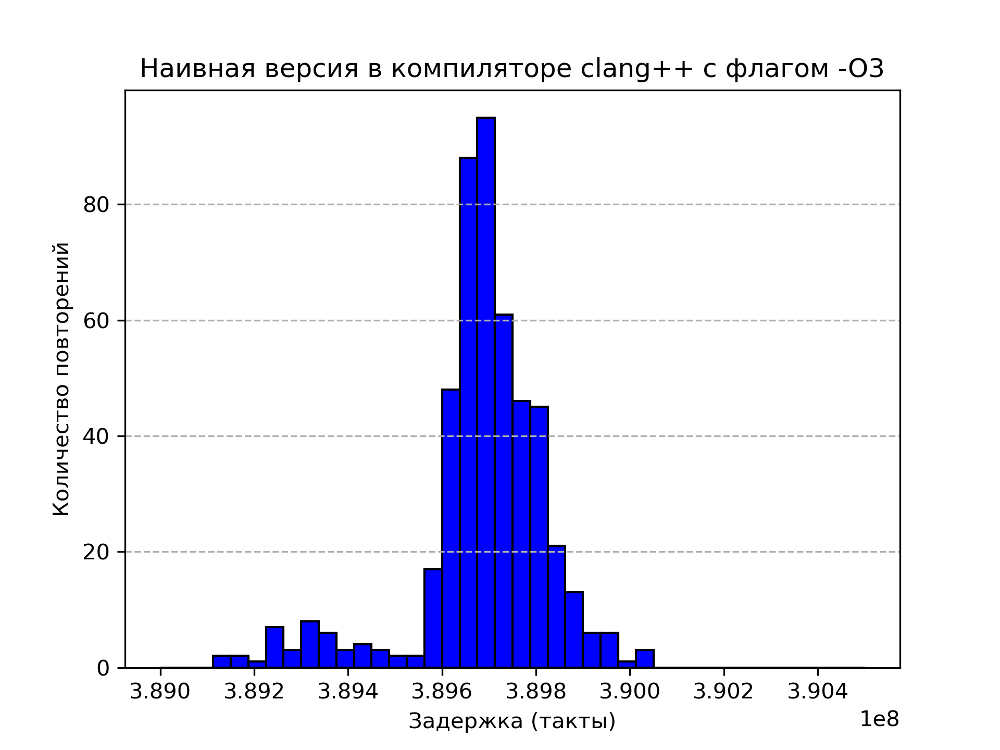
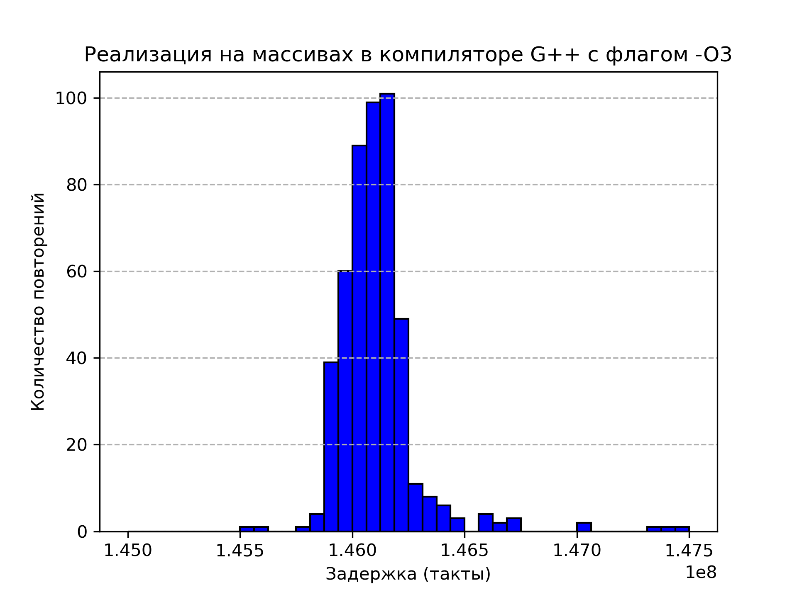
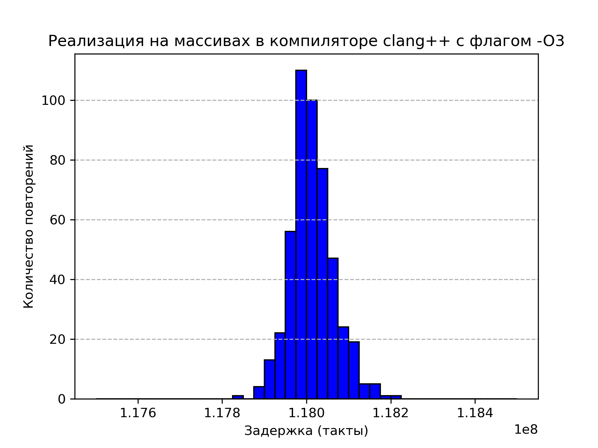
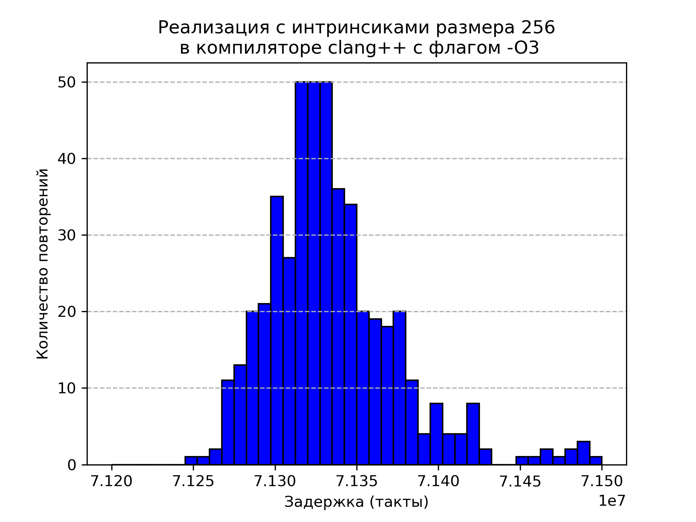
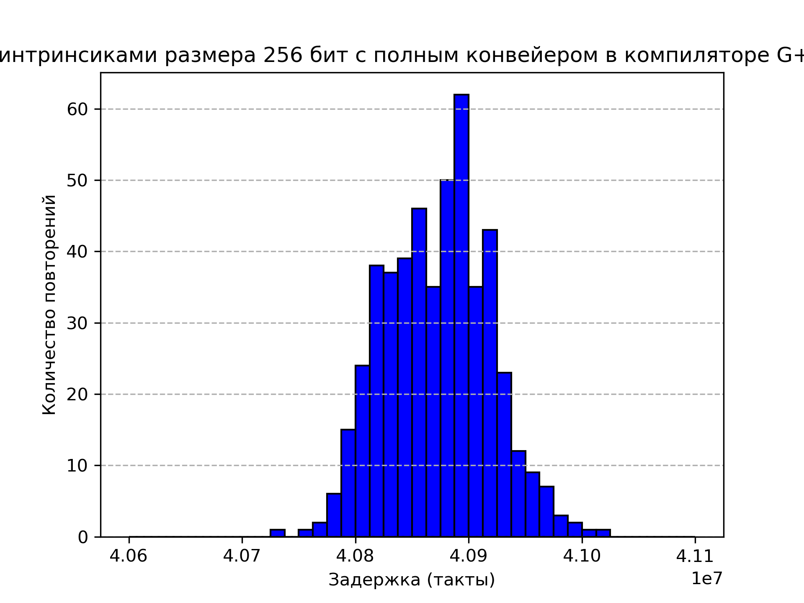
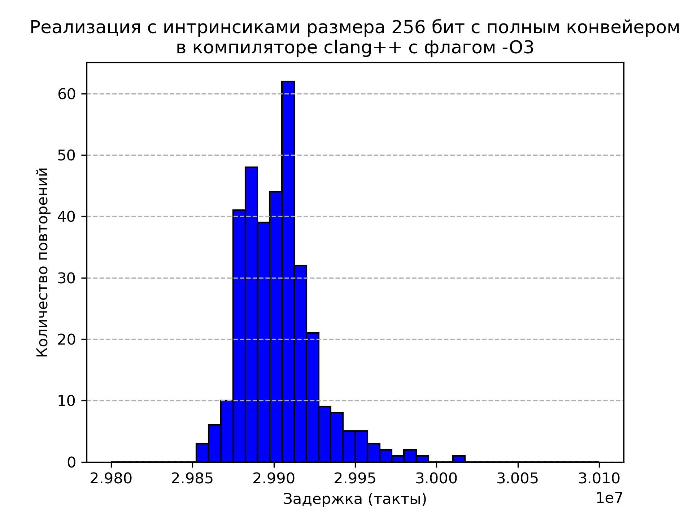

# Множество Мандельброта

## Суть задания

Суть задания заключалась в отрисовке множества Мандельброта и дальнейшей оптимизации вычислений его.

## Описание множества

Множество Мандельброта — множество точек **z<sub>0</sub>** на комплексной плоскости, для которых рекуррентное соотношение **z<sub>n+1</sub> = z<sub>n</sub><sup>2</sup> + z<sub>0</sub>** задаёт ограниченную последовательность. Таким образом, все эти точки не выходят за пределы како-то ограниченной области на комплексной плоскости.

Изображение множества на комплексной плоскости (цвет точки зависит от итерации, на которой элемент последовательности вылетает за пределы характерной окружности, с радиусом которой сравнивается расстояние от точки до начала отсчёта):


## Этапы оптимизации

### 1 этап: Наивная версия

Вычисления производились с каждой точкой в отдельности. Она считалась "не вылетевшей", пока лежала в пределах доверительной окружности. Количество итераций было ограничено сверху.

```C
MandelbrotError MandelbrotNaive (int* const iteration_stop_arr, const settings_of_program_t settings)
{
    ASSERT ((settings.graphic_mode) && (iteration_stop_arr != NULL), "MandelbrotNative got iteration_stop_arr as null ptr.\n");

    size_t screen_width  = settings.window_width;
    size_t screen_height = settings.window_height;

    float x_base = settings.coordinates_x;
    float y_base = settings.coordinates_y;

    float scale = settings.scale;

    for (size_t y_check = 0; y_check < screen_height; y_check++)
    {
        float y_start = (y_base - (float) y_check) / scale;

        for (size_t x_check = 0; x_check < screen_width; x_check++)
        {
            float x_start = ((float) x_check - x_base) / scale;

            float x_cur = x_start;
            float y_cur = y_start;

            int iteration_stop = 0;

            for (size_t num_point = 0; num_point < kMaxNumIteration; num_point++)
            {
                float square_x = x_cur * x_cur;
                float square_y = y_cur * y_cur;
                float dub_x_mul_y  = 2 * x_cur * y_cur;

                if (square_x + square_y < kMaxModuleComplex)
                {
                    iteration_stop++;
                    x_cur = square_x - square_y + x_start;
                    y_cur = dub_x_mul_y + y_start;
                }
                else
                {
                    break;
                }
            }

            if (settings.graphic_mode)
            {
                size_t ver_index = y_check * screen_width + x_check;
                iteration_stop_arr [ver_index] = iteration_stop;
            }
        }
    }

    return kDoneMandelbrot;
}
```

### 2 этап: Версия с массивами

Данная версия использует массивы так, чтобы компилятор, при упоминании флага оптимизации `-O2` смог подставить вместо циклов, работающих с массивами, инструкции, работающие с целым набором данных. Проверка данных подстановок была произведена с помощью сайта [Compiler Explorer](https://godbolt.org/)

Измерения показали, что данная оптимизация помогла ускорить процесс почти в 4 раза при использовании компилятора `G++` с флагом оптимизации `-O2`.
```C
#define _ARRAY_FOR_INSTRUCTION(body_for)                    \
            for (index = 0; index < kNumVertexes; index++)  \
            {                                               \
                body_for;                                   \
            }

MandelbrotError MandelbrotArray (int* const iteration_stop_arr, const settings_of_program_t settings)
{
    ASSERT ((settings.graphic_mode) && (iteration_stop_arr != NULL), "MandelbrotArray got iteration_stop_arr as null ptr.\n");

    size_t screen_width  = settings.window_width;
    size_t screen_height = settings.window_height;

    float x_base = settings.coordinates_x;
    float y_base = settings.coordinates_y;

    float scale = settings.scale;

    size_t index = 0;

    for (size_t y_check = 0; y_check < screen_height; y_check++)
    {
        float y_start [kNumVertexes] = {};
        _ARRAY_FOR_INSTRUCTION (y_start [index] = (y_base  - (float) y_check) / scale)

        for (size_t x_check = 0; x_check < screen_width; x_check += kNumVertexes)
        {
            float x_start [kNumVertexes] = {};
            _ARRAY_FOR_INSTRUCTION (x_start [index] = ((float) x_check + index - x_base) / scale)

            float x_cur [kNumVertexes] = {};
            _ARRAY_FOR_INSTRUCTION (x_cur [index] = x_start [index])

            float y_cur [kNumVertexes] = {};
            _ARRAY_FOR_INSTRUCTION (y_cur [index] = y_start [index])

            int iteration_stop [kNumVertexes] = {};

            for (size_t num_point = 0; num_point < kMaxNumIteration; num_point++)
            {
                float square_x [kNumVertexes] = {};
                _ARRAY_FOR_INSTRUCTION (square_x [index] = x_cur [index] * x_cur [index])

                float square_y [kNumVertexes] = {};
                _ARRAY_FOR_INSTRUCTION (square_y [index] = y_cur [index] * y_cur [index])

                float dub_x_mul_y [kNumVertexes] = {};
                _ARRAY_FOR_INSTRUCTION (dub_x_mul_y  [index] = 2 * x_cur [index] * y_cur [index])

                int cmp [kNumVertexes] = {};
                _ARRAY_FOR_INSTRUCTION (cmp [index] = (square_x [index] + square_y [index] < kMaxModuleComplex))

                _ARRAY_FOR_INSTRUCTION (iteration_stop [index] += cmp [index])

                int mask = 0;
                _ARRAY_FOR_INSTRUCTION (mask += cmp [index])

                _ARRAY_FOR_INSTRUCTION (x_cur [index] = square_x [index] - square_y [index] + x_start [index])
                _ARRAY_FOR_INSTRUCTION (y_cur [index] = dub_x_mul_y [index] + y_start [index])

                if (mask == 0)
                {
                    break;
                }
            }

            if (settings.graphic_mode)
            {
                size_t ver_index = y_check * screen_width + x_check;
                for (size_t point_index = 0; point_index < kNumVertexes; point_index++)
                {
                    iteration_stop_arr [ver_index] = iteration_stop [point_index];
                    ver_index++;
                }
            }
        }
    }

    return kDoneMandelbrot;
}

#undef _ARRAY_FOR_INSTRUCTION
```

### 3 этап: Версия с инструкциями **SIMD**

Данная оптимизация заключалась в подстановке вместо операций над массивами - инструкциями **intrinsic**, способными обрабатывать за одну операцию вектор из 8 чисел (использовались 256-битные интринсики).

```C
enum MandelbrotError Mandelbrot256 (int* const iteration_stop_arr, const settings_of_program_t settings)
{
    ASSERT ((settings.graphic_mode) && (iteration_stop_arr != NULL), "Mandelbrot256 got iteration_stop_arr as null ptr.\n");

    size_t screen_width  = settings.window_width;
    size_t screen_height = settings.window_height;

    float x_base = settings.coordinates_x;
    float y_base = settings.coordinates_y;

    float scale = settings.scale;

    const __m256 kArrOfTwo = _mm256_set1_ps (2);
    const unsigned int kFullBitsInt = 0xFF'FF'FF'FF;
    const __m256i kMaxInt32U256     = _mm256_set1_epi32 (kFullBitsInt);
    const __m256 kArrMaxModuleComplex256 = _mm256_set1_ps (kMaxModuleComplex);

    __m256 x_base_256 = _mm256_set1_ps (x_base);
    __m256 y_base_256 = _mm256_set1_ps (y_base);
    __m256 scale_256  = _mm256_set1_ps (scale);

    alignas (__m256i) int iteration_stop [kNumVertexesOptimize] = {};
    __m256i iteration_stop_256 = _mm256_load_si256 ((__m256i*) iteration_stop);

    for (size_t y_check = 0; y_check < screen_height; y_check++)
    {
        __m256 y_start   = _mm256_set1_ps ((float) y_check);
        y_start = _mm256_sub_ps (y_base_256, y_start);
        y_start = _mm256_div_ps (y_start, scale_256);

        for (size_t x_check = 0; x_check < screen_width; x_check += kNumVertexesOptimize)
        {
            __m256 x_start   = _mm256_set1_ps ((float) x_check);
            __m256 temp      = _mm256_set_ps (7, 6, 5, 4, 3, 2, 1, 0);

            x_start = _mm256_add_ps (x_start, temp);
            x_start = _mm256_sub_ps (x_start, x_base_256);
            x_start = _mm256_div_ps (x_start, scale_256);

            __m256 x_cur = x_start;
            __m256 y_cur = y_start;

            iteration_stop_256 = _mm256_setzero_si256 ();

            for (size_t num_point = 0; num_point < kMaxNumIteration; num_point++)
            {
                __m256 x_square = _mm256_mul_ps (x_cur, x_cur);
                __m256 y_square = _mm256_mul_ps (y_cur, y_cur);
                __m256 x_mul_y  = _mm256_mul_ps (x_cur, y_cur);

                __m256 x_square_cmp = _mm256_add_ps (x_square, y_square);

                __m256 sub_square      = _mm256_sub_ps (x_square, y_square);
                __m256 x_mul_y_mul_two = _mm256_mul_ps (x_mul_y, kArrOfTwo);

                __m256 cmp_square_mask = _mm256_cmp_ps (x_square_cmp, kArrMaxModuleComplex256, _CMP_LE_OS);

                iteration_stop_256 = _mm256_sub_epi32 (iteration_stop_256, (__m256i) cmp_square_mask);

                int mask = _mm256_movemask_ps (cmp_square_mask);

                cmp_square_mask = (__m256) _mm256_sub_epi32 (kMaxInt32U256,(__m256i) cmp_square_mask);

                if (mask == 0)
                {
                    break;
                }

                x_cur = _mm256_add_ps (sub_square, x_start);
                y_cur = _mm256_add_ps (x_mul_y_mul_two, y_start);

                x_cur = _mm256_or_ps (cmp_square_mask, x_cur);
                y_cur = _mm256_or_ps (cmp_square_mask, y_cur);
            }
            _mm256_storeu_si256 ((__m256i*) iteration_stop, iteration_stop_256);

            if (settings.graphic_mode)
            {
                size_t ver_index = y_check * screen_width + x_check;
                for (size_t point_index = 0; point_index < kNumVertexesOptimize; point_index++)
                {
                    iteration_stop_arr [ver_index] = iteration_stop [point_index];
                    ver_index++;
                }
            }
        }
    }

    return kDoneMandelbrot;
}
```

### 4 этап: Версия с инструкциями **SIMD** и развёрткой цикла

Данная оптимизация позволила заполнить конвейер независимыми по данным инструкциями, чередуя инструкции, работающие с первыми и с последними 8-ю точками (обработка шла построчно сверху - вниз по экрану, в данной обработке точки брались восьмёрками - по две восьмёрку за одну итерацию цикла).

Развёртка цикла производилась на **2** итерации (таким образом, два подряд идущих набора данных обрабатывались за одну итерацию цикла)

```C
enum MandelbrotError Mandelbrot256FullPipeLine (int* const iteration_stop_arr, const settings_of_program_t settings)
{
    ASSERT ((settings.graphic_mode) && (iteration_stop_arr != NULL), "Mandelbrot256FullPipeLine got iteration_stop_arr as null ptr.\n");

    size_t screen_width  = settings.window_width;
    size_t screen_height = settings.window_height;

    float x_base = settings.coordinates_x;
    float y_base = settings.coordinates_y;

    float scale = settings.scale;

    alignas (__m256i) int iteration_stop_1 [kNumVertexesOptimize] = {};
    __m256i iteration_stop_256_1 = _mm256_load_si256 ((__m256i*) iteration_stop_1);

    alignas (__m256i) int iteration_stop_2 [kNumVertexesOptimize] = {};
    __m256i iteration_stop_256_2 = _mm256_load_si256 ((__m256i*) iteration_stop_2);

    const __m256 kArrMaxModuleComplex256 = _mm256_set1_ps (kMaxModuleComplex);

    const __m256 kArrOfTwo = _mm256_set1_ps (2);
    const unsigned int kFullBitsInt = 0xFF'FF'FF'FF;
    const __m256i kMaxInt32U256     = _mm256_set1_epi32 (kFullBitsInt);

    __m256 x_base_256 = _mm256_set1_ps (x_base);
    __m256 y_base_256 = _mm256_set1_ps (y_base);
    __m256 scale_256  = _mm256_set1_ps (scale);

    __m256 temp_1 = _mm256_set_ps ( 7,  6,  5,  4,  3,  2,  1,  0);
    __m256 temp_2 = _mm256_set_ps (15, 14, 13, 12, 11, 10,  9,  8);

    for (size_t y_check = 0; y_check < screen_height; y_check++)
    {
        __m256 y_start    = _mm256_set1_ps ((float) y_check);
        y_start = _mm256_sub_ps (y_base_256, y_start);
        y_start = _mm256_div_ps (y_start, scale_256);

        for (size_t x_check = 0; x_check < screen_width; x_check += kNumVertexesOptimizeFullPipeLine)
        {
            __m256 x_start_1  = _mm256_set1_ps ((float) x_check);
            __m256 x_start_2  = x_start_1;

            x_start_1 = _mm256_add_ps (x_start_1, temp_1);
            x_start_2 = _mm256_add_ps (x_start_2, temp_2);

            x_start_1 = _mm256_sub_ps (x_start_1, x_base_256);
            x_start_2 = _mm256_sub_ps (x_start_2, x_base_256);

            x_start_1 = _mm256_div_ps (x_start_1, scale_256);
            x_start_2 = _mm256_div_ps (x_start_2, scale_256);

            __m256 y_cur_1 = y_start;
            __m256 y_cur_2 = y_start;

            __m256 x_cur_1 = x_start_1;
            __m256 x_cur_2 = x_start_2;

            iteration_stop_256_1 = _mm256_setzero_si256 ();
            iteration_stop_256_2 = _mm256_setzero_si256 ();

            for (size_t num_point = 0; num_point < kMaxNumIteration; num_point++)
            {
                __m256 x_square_1 = _mm256_mul_ps (x_cur_1, x_cur_1);
                __m256 y_square_1 = _mm256_mul_ps (y_cur_1, y_cur_1);
                __m256 x_mul_y_1  = _mm256_mul_ps (x_cur_1, y_cur_1);

                __m256 x_square_2 = _mm256_mul_ps (x_cur_2, x_cur_2);
                __m256 y_square_2 = _mm256_mul_ps (y_cur_2, y_cur_2);
                __m256 x_mul_y_2  = _mm256_mul_ps (x_cur_2, y_cur_2);

                __m256 x_square_cmp_1 = _mm256_add_ps (x_square_1, y_square_1);
                __m256 x_square_cmp_2 = _mm256_add_ps (x_square_2, y_square_2);

                __m256 sub_square_1 = _mm256_sub_ps (x_square_1, y_square_1);
                __m256 sub_square_2 = _mm256_sub_ps (x_square_2, y_square_2);
                __m256 x_mul_y_mul_two_1 = _mm256_mul_ps (x_mul_y_1, kArrOfTwo);
                __m256 x_mul_y_mul_two_2 = _mm256_mul_ps (x_mul_y_2, kArrOfTwo);

                __m256 cmp_square_mask_1 = _mm256_cmp_ps (x_square_cmp_1, kArrMaxModuleComplex256, _CMP_LE_OS);
                __m256 cmp_square_mask_2 = _mm256_cmp_ps (x_square_cmp_2, kArrMaxModuleComplex256, _CMP_LE_OS);

                int mask = _mm256_movemask_ps (cmp_square_mask_1)
                            + _mm256_movemask_ps (cmp_square_mask_2);

                iteration_stop_256_1 = _mm256_sub_epi32 (iteration_stop_256_1, (__m256i) cmp_square_mask_1);
                iteration_stop_256_2 = _mm256_sub_epi32 (iteration_stop_256_2, (__m256i) cmp_square_mask_2);

                cmp_square_mask_1 = (__m256) _mm256_sub_epi32 (kMaxInt32U256,(__m256i)  cmp_square_mask_1);
                cmp_square_mask_2 = (__m256) _mm256_sub_epi32 (kMaxInt32U256,(__m256i)  cmp_square_mask_2);

                if (mask == 0)
                {
                    break;
                }

                x_cur_1 = _mm256_add_ps (sub_square_1, x_start_1);
                y_cur_1 = _mm256_add_ps (x_mul_y_mul_two_1, y_start);

                x_cur_2 = _mm256_add_ps (sub_square_2, x_start_2);
                y_cur_2 = _mm256_add_ps (x_mul_y_mul_two_2, y_start);

                x_cur_1 = _mm256_or_ps (cmp_square_mask_1, x_cur_1);
                y_cur_1 = _mm256_or_ps (cmp_square_mask_1, y_cur_1);

                x_cur_2 = _mm256_or_ps (cmp_square_mask_2, x_cur_2);
                y_cur_2 = _mm256_or_ps (cmp_square_mask_2, y_cur_2);
            }
            _mm256_storeu_si256 ((__m256i*) iteration_stop_1, iteration_stop_256_1);
            _mm256_storeu_si256 ((__m256i*) iteration_stop_2, iteration_stop_256_2);

            if (settings.graphic_mode)
            {
                size_t ver_index = y_check * screen_width + x_check;
                for (size_t point_index = 0; point_index < kNumVertexesOptimize; point_index++)
                {
                    iteration_stop_arr [ver_index]                        = iteration_stop_1 [point_index];
                    iteration_stop_arr [ver_index + kNumVertexesOptimize] = iteration_stop_2 [point_index];
                    ver_index++;
                }
            }
        }
    }

    return kDoneMandelbrot;
}
```

## Сравнение разных компиляторов

<!--
Naive G++ -O2
Измерения показали, что в среднем на отрисовку одного кадра при фиксированной частоте процессора в 2 ГГц тратиться (39.8 ± 0.1) * 10<sup>7</sup> тактов процессора.

Array G++ -O2
Измерения показали, что в среднем на отрисовку одного кадра при фиксированной частоте процессора в 2 ГГц тратиться (10.37 ± 0.02) * 10<sup>7</sup> тактов процессора.

SIMD 256 G++ -O2
Измерения показали, что в среднем на отрисовку одного кадра при фиксированной частоте процессора в 2 ГГц тратиться (6.55 ± 0.02) * 10<sup>7</sup> тактов процессора.

SIMD 256 Full Pipeline  G++ -O2
Измерения показали, что в среднем на отрисовку одного кадра при фиксированной частоте процессора в 2 ГГц тратиться (4.10 ± 0.01) * 10<sup>7</sup> тактов процессора.

-----------------------------------------------------------------

Naive G++ -O3
Измерения показали, что в среднем на отрисовку одного кадра при фиксированной частоте процессора в 2 ГГц тратиться (39.75 ± 0.09) * 10<sup>7</sup> тактов процессора.

Array G++ -O3
Измерения показали, что в среднем на отрисовку одного кадра при фиксированной частоте процессора в 2 ГГц тратиться (14.65 ± 0.1) * 10<sup>7</sup> тактов процессора.

SIMD 256 G++ -O3
Измерения показали, что в среднем на отрисовку одного кадра при фиксированной частоте процессора в 2 ГГц тратиться (6.54 ± 0.02) * 10<sup>7</sup> тактов процессора.

SIMD 256 Full Pipeline  G++ -O3
Измерения показали, что в среднем на отрисовку одного кадра при фиксированной частоте процессора в 2 ГГц тратиться (4.10 ± 0.02) * 10<sup>7</sup> тактов процессора.

 -->

Все измерения производились при фиксированной частоте процессора в **2 ГГц**.

Фиксирование происходило по средством команд:
``` bash
sudo cpupower frequency-set -u 2010Mhz
sudo cpupower frequency-set -d 1990Mhz
```
После завершения снятия измерений фиксация сбрасывалась командой:
``` bash
sudo cpupower frequency-set -g ondemand
```

<table>
    <thead>
        <tr>
            <th align="center" >Реализация</th>
            <th align="center" colspan = 4>Средняя задержка, потраченная на обработку одного кадра, в тактах *10<sup>7</sup> в зависимости от компилятора и флага оптимизации</th>
        </tr>
    </thead>
    <tbody>
        <tr>
            <td align="center" rowspan = 2></td>
            <td align="center" colspan = 2>g++</td>
            <td align="center" colspan = 2>clang++</td>
        </tr>
        <tr>
            <td align="center">-O2</td>
            <td align="center">-O3</td>
            <td align="center">-O2</td>
            <td align="center">-O3</td>
        </tr>
        <tr>
            <td align="center">Наивная реализация</td>
            <td align="center">39.8 ± 0.1
            
            </td>
            <td align="center">39.75 ± 0.09
            
            </td>
            <td align="center">39.06 ± 0.08
            
            </td>
            <td align="center">39.0 ± 0.1
            
            </td>
        </tr>
        <tr>
            <td align="center">Реализация на массивах</td>
            <td align="center">10.37 ± 0.02
            
            </td>
            <td align="center">14.65 ± 0.1
            
            </td>
            <td align="center">11.82 ± 0.03
            
            </td>
            <td align="center">11.83 ± 0.04
            
            </td>
        </tr>
        <tr>
            <td align="center">Реализация с использованием SIMD</td>
            <td align="center">6.55 ± 0.02
            
            </td>
            <td align="center">6.54 ± 0.02
            
            </td>
            <td align="center">7.15 ± 0.03
            
            </td>
            <td align="center">7.15 ± 0.03
            
            </td>
        </tr>
        <tr>
            <td align="center">Реализация с использованием SIMD и развёрткой цикла</td>
            <td align="center">4.10 ± 0.01
            
            </td>
            <td align="center">4.10 ± 0.02
            
            </td>
            <td align="center">4.55 ± 0.07
            
            </td>
            <td align="center">4.49 ± 0.02
            
            </td>
        </tr>
    </tbody>
</table>

<table>
    <thead>
        <tr>
            <th align="center" >Реализация</th>
            <th align="center" colspan = 4>Во сколько раз ускорилась работа программы относительно наивной версии в зависимости от компилятора и флага оптимизации</th>
        </tr>
    </thead>
    <tbody>
        <tr>
            <td align="center" rowspan = 2></td>
            <td align="center" colspan = 2>g++</td>
            <td align="center" colspan = 2>clang++</td>
        </tr>
        <tr>
            <td align="center">-O2</td>
            <td align="center">-O3</td>
            <td align="center">-O2</td>
            <td align="center">-O3</td>
        </tr>
        <tr>
            <td align="center">Наивная реализация</td>
            <td align="center">1</td>
            <td align="center">1</td>
            <td align="center">1</td>
            <td align="center">1</td>
        </tr>
        <tr>
            <td align="center">Реализация на массивах</td>
            <td align="center">3.84 ± 0.01</td>
            <td align="center">2.71 ± 0.02</td>
            <td align="center">3.30 ± 0.01</td>
            <td align="center">3.30 ± 0.01</td>
        </tr>
        <tr>
            <td align="center">Реализация с использованием SIMD</td>
            <td align="center">6.08 ± 0.02</td>
            <td align="center">6.08 ± 0.02</td>
            <td align="center">5.46 ± 0.03</td>
            <td align="center">5.45 ± 0.03</td>
        </tr>
        <tr>
            <td align="center">Реализация с использованием SIMD и развёрткой цикла</td>
            <td align="center">9.71 ± 0.03</td>
            <td align="center">9.70 ± 0.05</td>
            <td align="center">8.6 ± 0.1</td>
            <td align="center">8.69 ± 0.04</td>
        </tr>
        <tr>
            <td align="center">Диаграммы затраченного времени в тактах процессора на одну итерацию отрисовки экрана</td>
            <td align="center">
            
            </td>
            <td align="center">
            
            </td>
            <td align="center">
            
            </td>
            <td align="center">
            
            </td>
        </tr>
    </tbody>
</table>

## Вывод
Приведённые оптимизации не ускоряют программу ровно в 4, в случае с оптимизацией на массивах, и ровно в 8, в случае с оптимизацией с интринсиками, так как есть некоторые участки функции, где нет оптимизированных вычислений, то есть время, потраченное на их обработку, всегда будет входить в измерения.

Однако, данные способы помогают ускорить программу до 9.7 раз, что означает, что не стоит пренебрегать ими.
